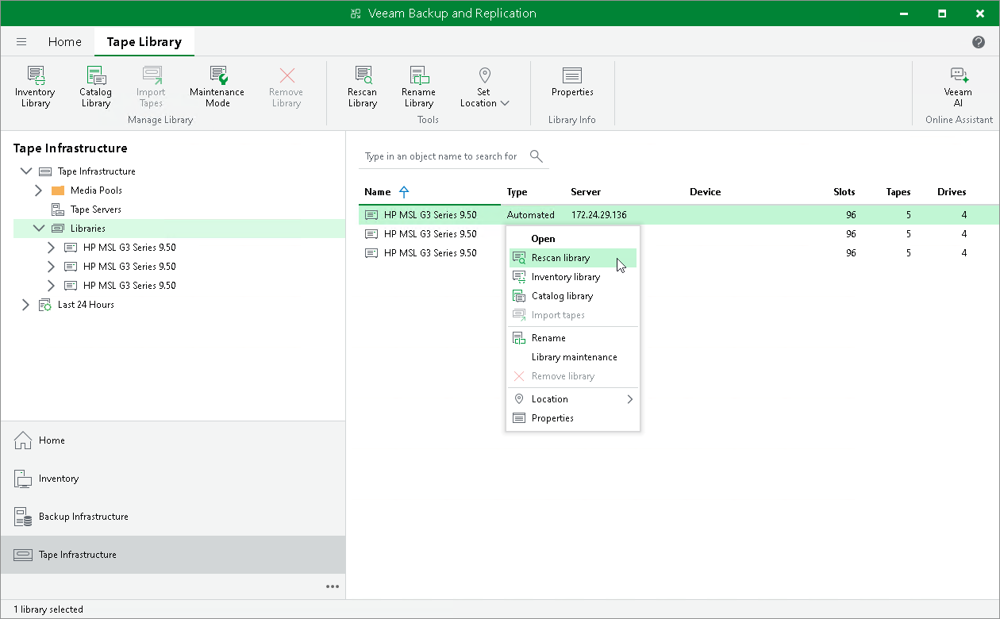

# Rescanning Tape Devices

You can rescan a selected tape library or standalone tape drive to update its network status.

To rescan a tape device:

1. Open the Tape Infrastructure view.
2. Select the Libraries node in the inventory pane.
3. Select a necessary item in the working area and click Rescan Library on the ribbon. You can also right-click the necessary device in the working area and select Rescan library.

