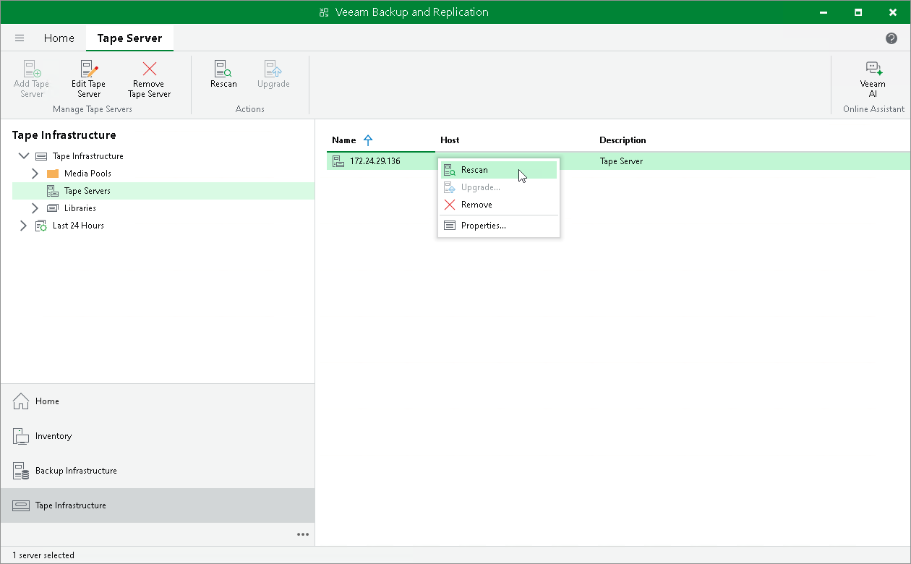

# Rescanning Tape Servers

In this article

Veeam Backup & Replication automatically rescans the tape servers every 3 minutes. During the rescan, Veeam Backup & Replication updates the list of managed tape devices. You can perform manual rescan of a tape server, for example, if you want to implement the changes made to the tape infrastructure immediately.

To rescan a tape server:

1. Open the Tape Infrastructure view.
2. To rescan all tape servers, right-click the Servers node and select Rescan.
3. To rescan a selected tape server, select the Servers node in the inventory pane. Select the necessary server in the working area and click Rescan on the ribbon. You can also right-click the necessary server in working area and select Rescan.

Page updated 7/10/2023

Page content applies to build 13.0.1.1071
