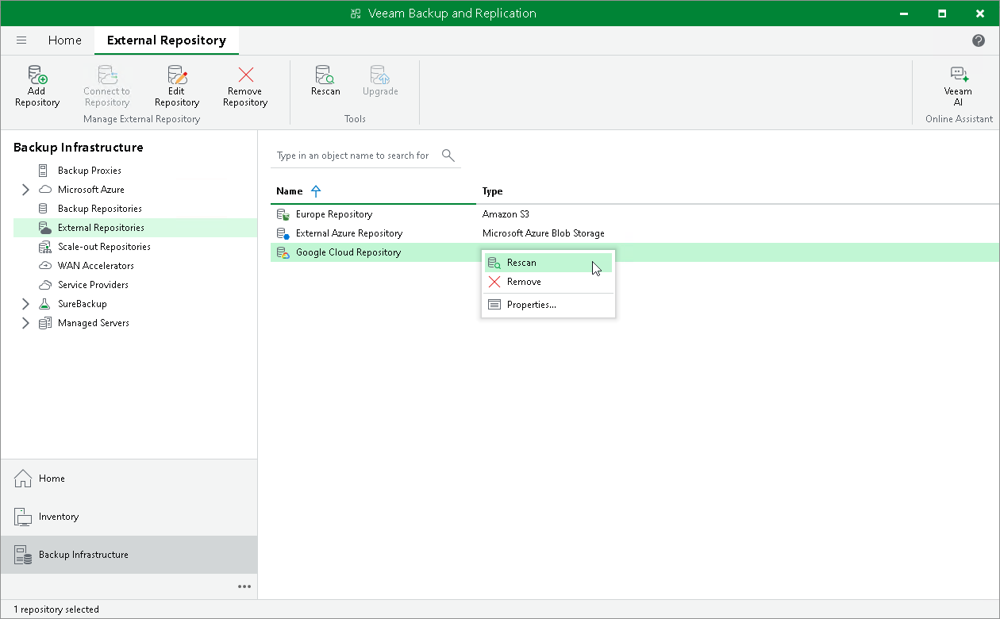

# Rescanning External Repositories

In this article

To synchronize the state of an external repository with the state of an object storage (Amazon S3, Azure Blob or Google Cloud Storage), you can use the rescan feature. During rescan, Veeam Backup & Replication fetches newly created restore points and other required metadata.

Consider the following:

* Rescan is done automatically in the following cases:

* After you add an external repository to the backup infrastructure.
* Every 24 hours.
* After a backup chain is modified in the object storage. For example, if a restore point is added or deleted.

* Rescan session results are saved to the configuration database and can be found in the History view under the System node.

To rescan external repositories manually:

1. Open the Backup Infrastructure view.
2. In the inventory pane, click External Repositories.
3. Select a repository you want to rescan and click Rescan on the ribbon menu or right-click a repository and select Rescan.

If you have more than one external repository added to the scope, you may want to rescan all the repositories altogether. For that, right-click the root External Repositories node in the management pane and select Rescan.

Related Topics

[Adding External Repository](external_repositories_add.md)

Page updated 8/6/2025

Page content applies to build 13.0.1.1071
