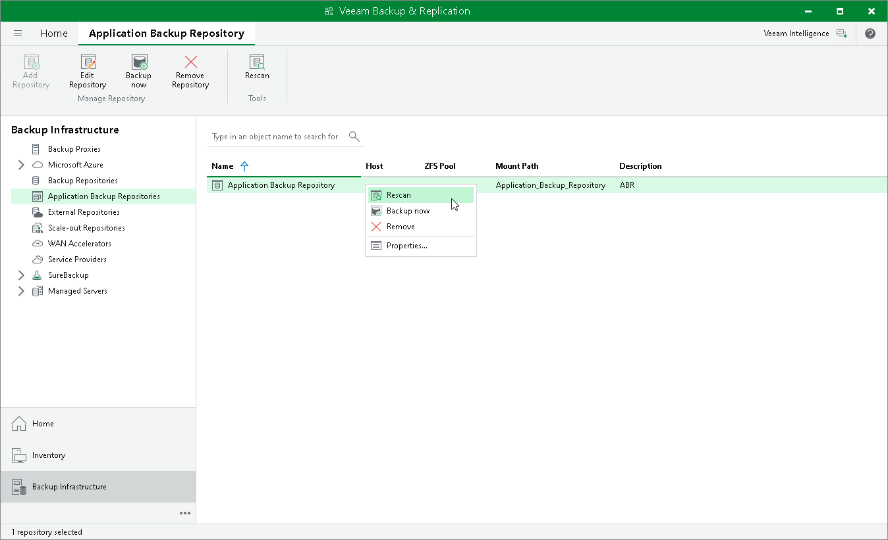

# Rescanning Application Backup Repositories

To synchronize the data of an application backup repository with Veeam Backup & Replication, you can use the rescan feature. During rescan, Veeam Backup & Replication updates licensing information, fetches details of the new snapshot creation sessions and adds new restore points to the configuration database.

Rescan is done automatically in the following cases:

* After a new application backup repository snapshot was taken.
* Every 24 hours.

Rescan session results are saved to the configuration database and can be found in the History view under the System node.

To launch the repository rescan operation manually:

1. Open the Backup Infrastructure view.
2. In the inventory pane, select Application Backup Repositories.
3. In the working area, select an application backup repository and click Rescan on the ribbon or right-click an application backup repository and select Rescan.

Page updated 2026-07-22

