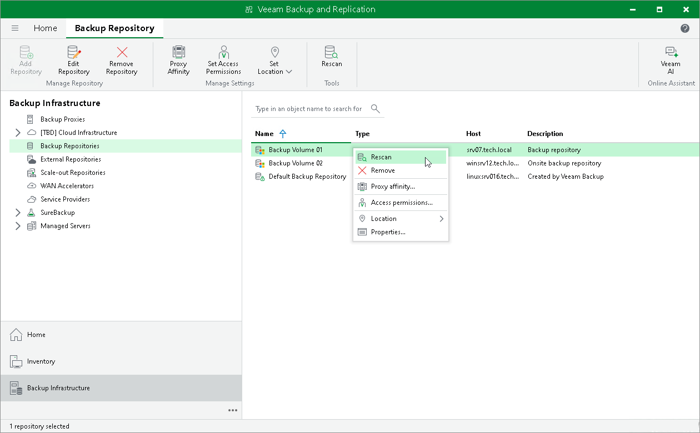

# Rescanning Backup Repositories

In this article

You can rescan a backup repository configured in the backup infrastructure. Backup repository rescan may be required, for example, if you have archived backups from a backup repository to tape and deleted backup files in the backup repository. Or you have copied backups to the backup repository manually and want to work with them in Veeam Backup & Replication.

During the rescan operation, Veeam Backup & Replication gathers information about backups that are currently available in the backup repository and updates the list of backups in the configuration database. After the rescan operation, backups that were not in this configuration database will be shown on the Home view in the Backups > Disk (Imported) node. If backups are encrypted, they will be shown in the Backups > Disk (Encrypted) node.

|  |
| --- |
| Important |
| Consider the following:   * It is recommended that you stop or disable all jobs before performing the rescan.Veeam Backup & Replication skips from scanning backups created by active jobs. * Veeam Backup & Replication will not be able to import backups automatically while performing a rescan if VBM files are not available. In this case you will have to import backups manually using the VBK files. For more information, see [Importing Backups Manually](importing_backups.md). |

To rescan a backup repository:

1. Open the Backup Infrastructure view.
2. In the inventory pane, select the Backup Repositories node.
3. In the working area, select the backup repository and click Rescan Repository on the ribbon or right-click the backup repository and select Rescan repository.

|  |
| --- |
| Tip |
| By default, Veeam Backup & Replication skips from rescan files whose paths contain $RECYCLE.BIN or .Trash-<digits>. You can exclude other file paths in the in the configuration file on the Linux-based backup server or with a registry value on the Microsoft Windows-based backup server. For more information, contact Veeam Customer Support. |

Page updated 10/20/2025

Page content applies to build 13.0.1.1071
