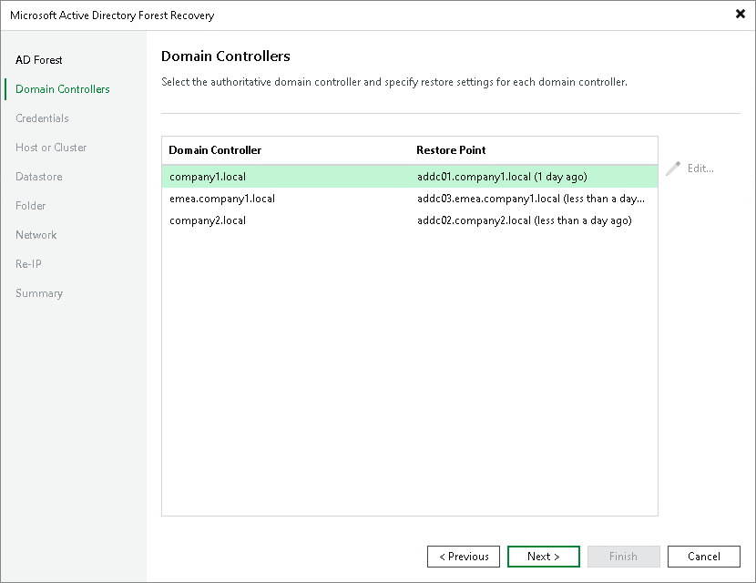

# Step 3. Specify Restore Points for Authoritative Domain Controllers

At the Domain Controllers step of the wizard, select a restore point for each domain in the forest.

The table lists all domains detected in the selected forest. For each domain, Veeam Backup & Replication pre-populates the authoritative domain controller and the restore point based on the selected point in time. To change the authoritative domain controller or restore point for a domain:

1. Select the domain in the list and click Edit.
2. In the domain settings window, select the authoritative domain controller and the restore point to use.

You can select a restore point only for the authoritative domain controllers of the non-root domains. The restore point for the root domain controller was set at the [AD Forest](restore_ad_forest_pit_vm.md) step of the wizard, where it defines the forest point in time.

1. Click OK.

|  |
| --- |
| Note |
| The restore points that you select must use a supported Active Directory schema version. The minimum supported version is Windows Server 2016. In addition, the restore point selected for the forest root domain must have a schema version that is greater than or equal to the schema version of every other domain. |

Page updated 2026-07-28

