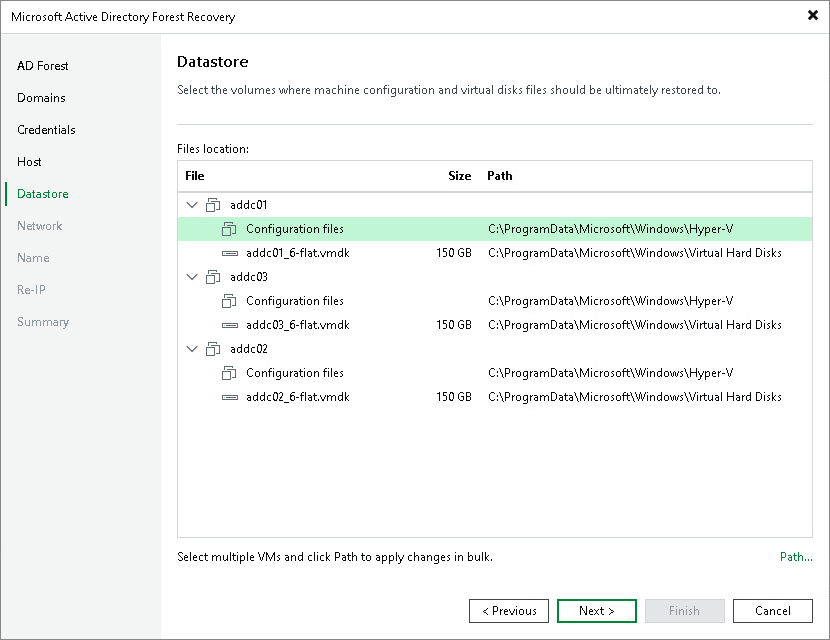

# Step 6. Select Datastores

At the Datastore step of the wizard, specify the path to the folder where the configuration files and virtual disks of the domain controllers will be stored.

1. In the File location list, expand the domain controller nodes, select the necessary configuration file or virtual disk and click Path. To select multiple objects at once, press and hold [Ctrl] or [Shift].
2. In the Select Folder window, do one of the following:

* Select an existing folder where the files will be stored.
* Create a new folder by clicking New Folder at the bottom of the window.
* Type a path to an SMB3 shared folder in the search field at the bottom of the Select Folder window. The path must be specified in the UNC format, for example: \\172.16.11.38\Share01.

|  |
| --- |
| Important |
| The host or cluster on which you register the domain controllers must have access to the specified SMB3 shared folder. If you are using SCVMM 2012 or later, the server hosting the Microsoft SMB3 shared folder must be registered in SCVMM as a storage device. For more information, see [Microsoft Docs](https://docs.microsoft.com/en-us/previous-versions/system-center/system-center-2012-R2/jj614620%28v%3Dsc.12%29). |

Page updated 2026-07-31

