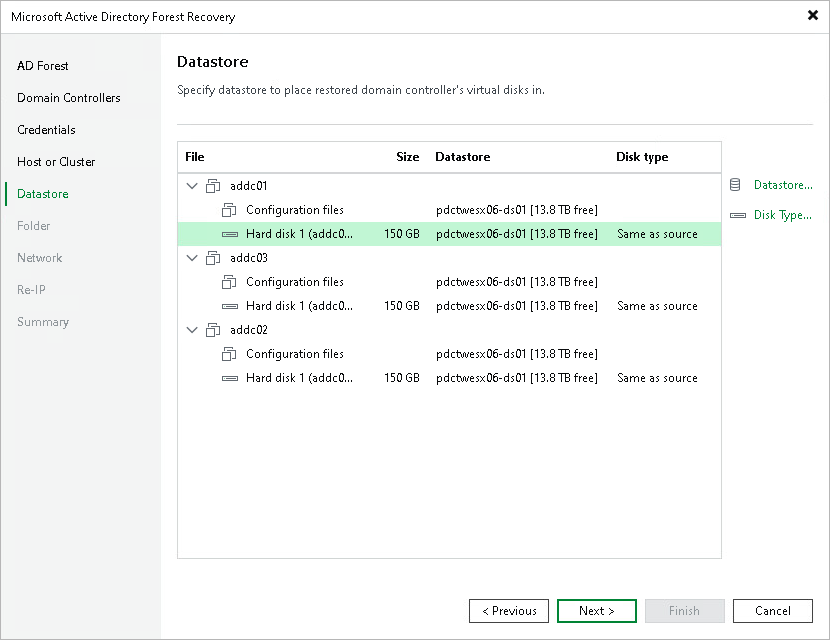

# Step 6. Select Datastores

At the Datastore step of the wizard, specify the datastores for the virtual disks of each domain controller.

By default, the table shows the configuration files and virtual disks with the assigned datastore. By default, Veeam Backup & Replication uses the original datastore from the source environment. To change the datastore or disk type, do the following:

1. Expand the domain controller nodes, select one or more configuration files or virtual disks in the table and click Datastore to assign a different datastore.
2. Select a virtual disk and click Disk Type to change the disk type,

To select multiple items at once, press and hold [Ctrl] or [Shift].

Page updated 2026-07-31

