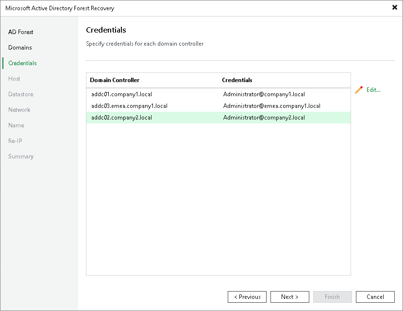

# Step 4. Specify Domain Controller Credentials

At the Credentials step of the wizard, specify the credentials that Veeam Backup & Replication uses to connect to each domain controller during the restore process.

To set or change credentials for a domain controller:

1. Select one or more domain controllers in the list and click Edit. To select multiple domain controllers at once, press and hold [Ctrl] or [Shift].
2. Select or add an account with sufficient permissions to perform the recovery on the domain controller.
3. Click OK.

|  |
| --- |
| Note |
| Forest recovery requires an account with Domain Admin privileges for each domain controller. Only standard credentials with a user name and password are supported — other credential types cannot be used. |

Page updated 2026-07-24

