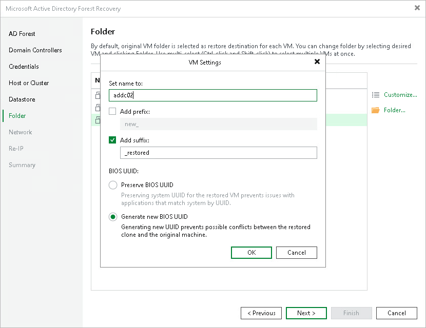
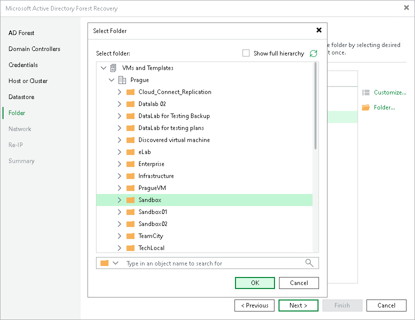

# Step 7. Select Folder

At the Folder step of the wizard, select the destination folder for the domain controllers to restore and configure their VM name and BIOS UUID settings.

Customize

To customize VM name and BIOS UUID settings, select a domain controller and click Customize. In the VM Settings window, configure the following:

1. In the Set name to field, enter a new name for the restored VM, or keep the original name.

1. To add a prefix to the VM name, select the Add prefix check box and enter the prefix in the field.
2. To add a suffix to the VM name, select the Add suffix check box and enter the suffix in the field.

1. Under BIOS UUID, select either of the following options:

* Preserve BIOS UUID — preserves the system UUID of the source VM. Select this option to avoid issues with applications that identify the system by UUID.
* Generate new BIOS UUID — assigns a new UUID to the restored VM. Select this option to prevent conflicts between the restored VM and the original machine.

1. Click OK.

To select multiple domain controllers at once, press and hold [Ctrl] or [Shift]. Note that in this case, the Set name to field will not be available.

Folder

By default, the original VM folder is selected as the restore destination for each domain controller. To change the destination folder, select one or more domain controllers and click Folder. To select multiple domain controllers at once, press and hold [Ctrl] or [Shift]. In the Select Folder window, browse the folder hierarchy or type an object name in the search field to find the target folder. Click OK.

Page updated 2026-07-28

