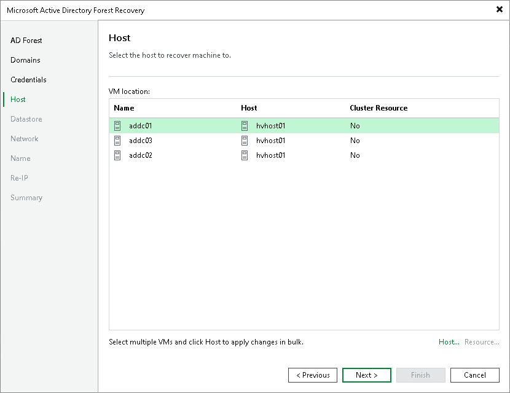

# Step 5. Select Hosts

At the Host step of the wizard, select the target Hyper-V host or cluster for each domain controller.

The table lists the domain controllers with the assigned target host or cluster. To change the target host or cluster for a domain controller:

1. In the VM location list, select one or more domain controllers and click Host. To select multiple domain controllers at once, press and hold [Ctrl] or [Shift].
2. In the Select Host window, select a standalone host or cluster where the domain controller will be registered.
3. If you selected a Hyper-V cluster, you can specify the cluster resource settings. Click Resource and select one of the following options in the Cluster Resource Settings window:

* Register VM as a cluster resource — assigns a cluster role to the restored domain controller.
* Do not register VM as a cluster resource — does not assign a cluster role to the restored domain controller.

Page updated 2026-07-24

