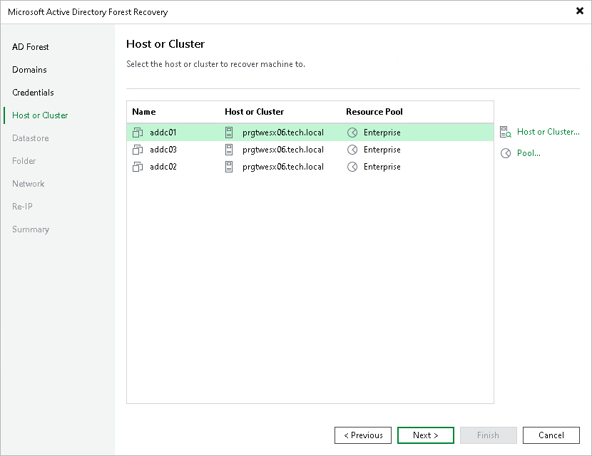

# Step 5. Select Hosts

At the Host or Cluster step of the wizard, select the target host or cluster for each domain controller. You can also select a resource pool.

By default, the table lists the domain controllers with the host or cluster and the resource pool from the backup. To change the host, cluster or resource pool for a domain controller, do the following:

1. Select one or more domain controllers in the list and click Host or Cluster to select a different target host or cluster.
2. Select one or more domain controllers in the list and click Pool to change the resource pool.

To select multiple domain controllers at once, press and hold [Ctrl] or [Shift].

Page updated 2026-07-24

