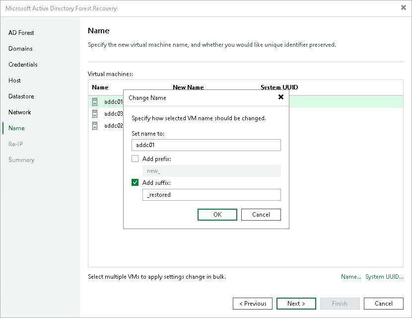
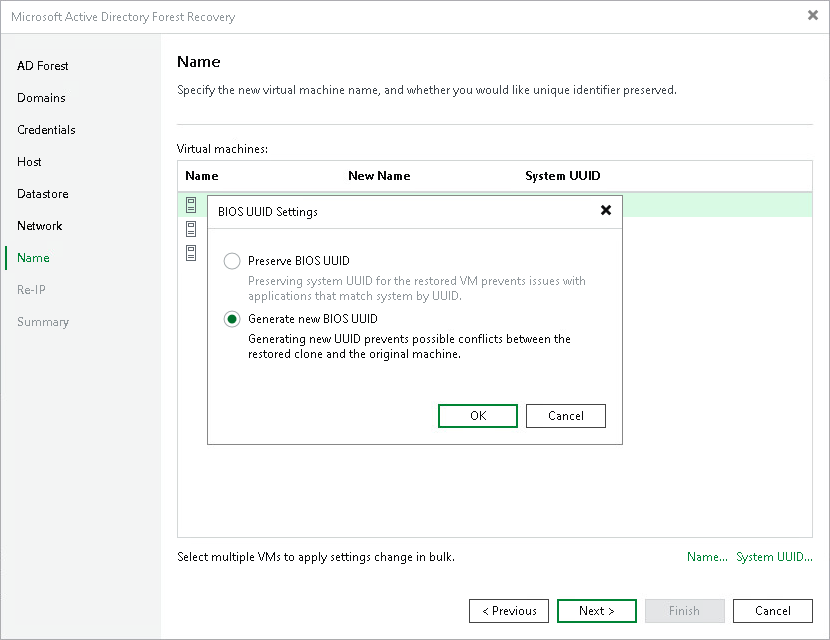

# Step 8. Specify VM Names and UUIDs

At the Name step of the wizard, specify the names under which the domain controllers will be restored and select whether to preserve or generate new system UUIDs. By default, Veeam Backup & Replication preserves the original names and UUIDs.

Changing Names

To change the name of a domain controller:

1. In the Virtual machines list, select a domain controller and click Name.

1. In the Set name to field, enter a new name for the restored VM, or keep the original name.

1. To add a prefix to the VM name, select the Add prefix check box and enter the prefix in the field.
2. To add a suffix to the VM name, select the Add suffix check box and enter the suffix in the field.

1. Click OK.

To select multiple domain controllers at once, press and hold [Ctrl] or [Shift]. Note that in this case, the Set name to field will not be available.

Changing System UUIDs

To change the system UUID settings:

1. In the Virtual machines list, select one or more domain controllers and click System UUID. To select multiple domain controllers at once, press and hold [Ctrl] or [Shift].

1. In the BIOS UUID Settings window, select either of the following options:

* Preserve BIOS UUID — preserves the system UUID of the source VM. Select this option to avoid issues with applications that identify the system by UUID.
* Generate new BIOS UUID — assigns a new UUID to the restored VM. Select this option to prevent conflicts between the restored VM and the original machine.

1. Click OK.

Page updated 2026-07-28

