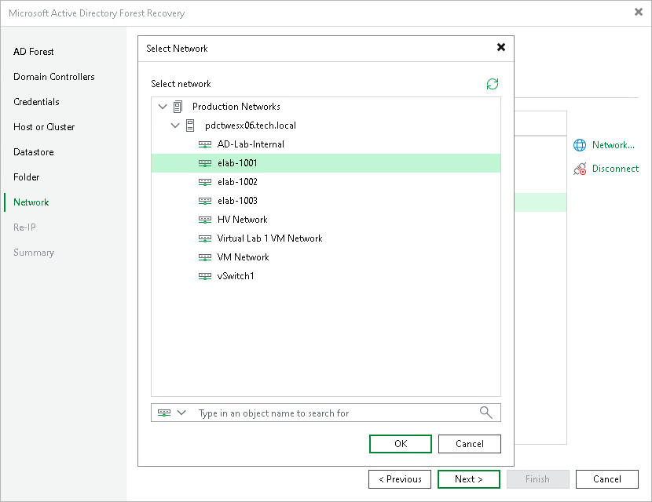

# Step 8. Configure Network Mapping

At the Network step of the wizard, map source virtual networks to target virtual networks for each domain controller to restore.

The table lists domain controllers grouped by name. For each domain controller, the table shows its network adapters with the source network and the mapped target network. By default, Veeam Backup & Replication maps each source network to a network with the same name on the target host.

To change the target network for a network adapter, do the following:

1. In the table, expand the domain controller nodes and select one or more network adapters. To select multiple network adapters at once, press and hold [Ctrl] or [Shift].
2. Click Network.
3. In the Select Network window, browse the network tree or type an object name in the search field to find the target network.
4. Click OK.

To disconnect a network adapter in the restored VM, do the following:

1. In the table, expand a domain controller node and select the network adapter.
2. Click Disconnect.

|  |
| --- |
| Note |
| Each domain controller must have at least one network adapter mapped to a target network. Veeam Backup & Replication does not support restoring a domain controller without a network connection. |

Page updated 2026-07-31

