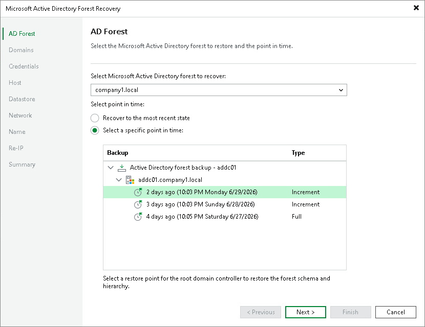

# Step 2. Specify Forest and Point in Time

At the AD Forest step of the wizard, select the Active Directory forest you want to restore and specify the restore point:

1. From the drop-down menu under Select Microsoft Active Directory forest to recover, select the Active Directory forest you want to restore. The drop-down menu contains the forest root domains of all available Active Directory forests in your infrastructure, across various job and backup types.
2. Under Select point in time, select a point in time for the root domain controller, which defines the schema and hierarchy of the forest.

Select either of the following options:

* Recover to the most recent state — restores the forest to the latest available restore point.
* Select a specific point in time — restores the forest to any other restore point. Expand the backup and domain controller nodes and select a restore point from the list.

|  |
| --- |
| Note |
| A Windows mount server must be available for the repository that stores the backups. Before you start the recovery, configure a Windows mount server for the repository or set a default Windows mount server. |

Page updated 2026-07-31

