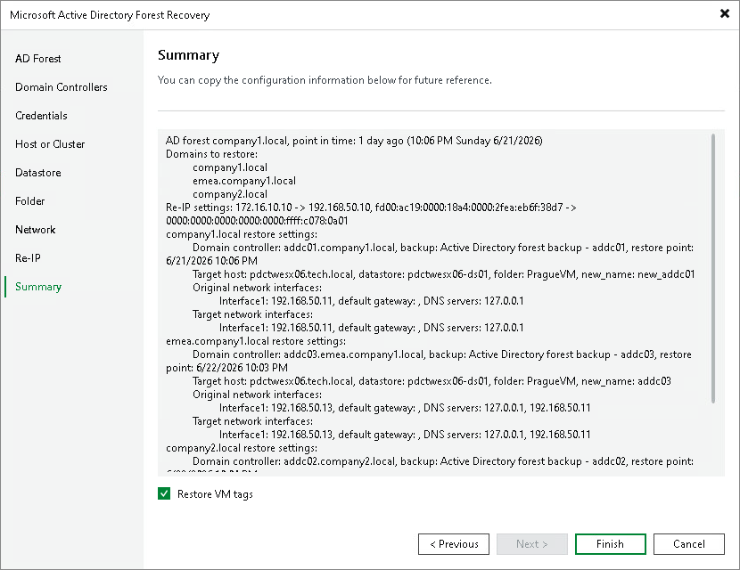

# Step 10. Finish Working with Wizard

At the Summary step of the wizard, review the configured restore settings. The summary shows the restore type, the domains to restore and the restore plan for each domain. For each domain controller, the summary includes the original and new machine names, target host, target folder and network mapping.

Select the Restore VM tags check box to reassign the original VMware vSphere tags to the restored domain controller VMs.

To save the restore configuration for future reference, copy the summary text.

If the settings are correct, click Finish to start the Active Directory forest restore.

|  |
| --- |
| Note |
| When you click Finish, if VMs with the same names already exist at the target location, Veeam Backup & Replication shows the list of objects that will be overwritten and asks you to confirm. The existing VMs and their disks are removed before the recovery starts. |

Page updated 2026-07-02

