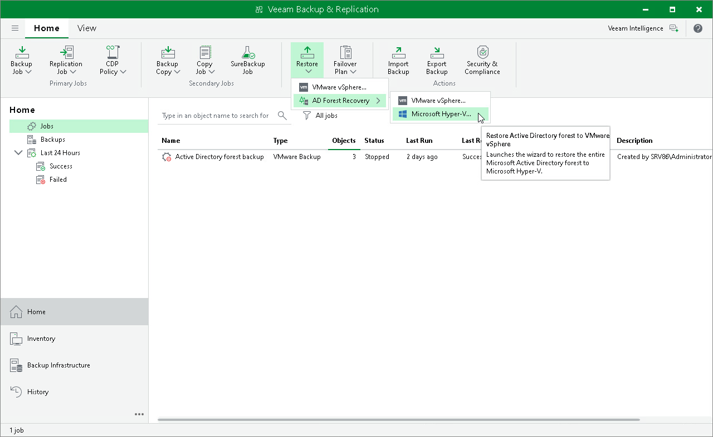

# Step 1. Launch Restore Wizard

To launch the Microsoft Active Directory Forest Recovery wizard, do the following:

1. Open the Home view. On the ribbon, click Restore and select AD Forest Recovery.
2. Select Microsoft Hyper-V as the target platform for the restored domain controllers.

Page updated 2026-07-24

