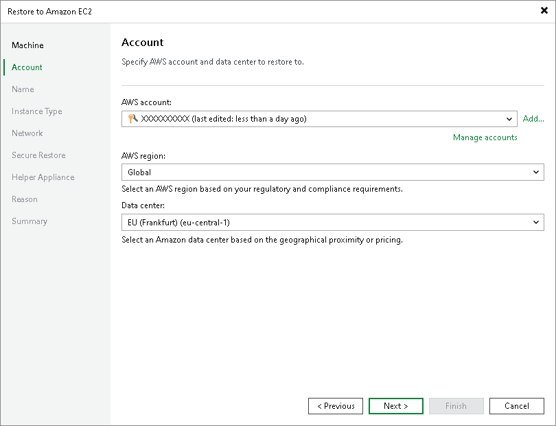

# Step 3. Specify Credentials and Region Settings

At the Account step of the wizard, specify AWS user credentials and region:

1. From the AWS account list, select credentials of a user account that will be used to connect to AWS. This user account must have permissions listed in section [AWS IAM User Permissions](restore_amazon_permissions.md).

When you add AWS user credentials, Veeam Backup & Replication imports information about resources associated with this user. During the restore process, Veeam Backup & Replication accesses these resources and uses them to create a target instance in Amazon EC2.

If you have not set up credentials beforehand in the [Cloud Credentials Manager](cloud_credentials.md), click the Manage accounts link or click Add on the right to add the necessary credentials.

1. From the AWS region list, select the AWS region in which Veeam Backup & Replication will restore workloads as Amazon EC2 instances.
2. From the Datacenter region list, select the geographic region where Veeam Backup & Replication will restore the workloads.

