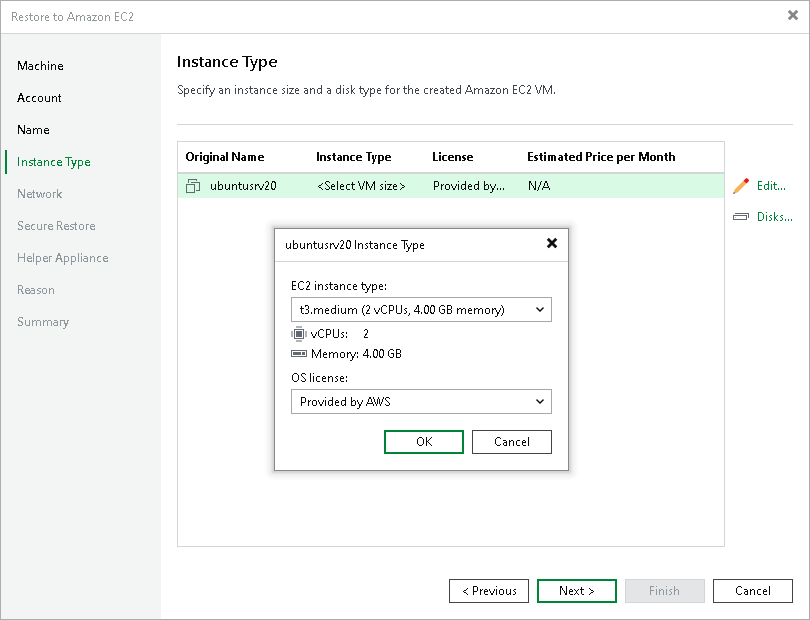
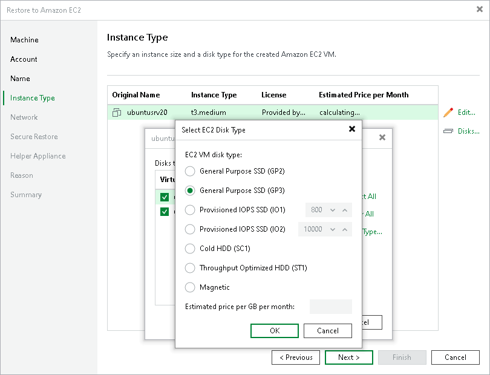

# Step 5. Specify Instance Type and Disks

At the Instance Type step of the wizard, you can configure the instance type for the restored workload, select which disks to restore and change their type. By default, Veeam Backup & Replication restores all disks as Amazon Elastic Block Store (EBS) volumes of the General Purpose SSD type. For information on types of EBS volumes, see the [AWS Documentation](https://docs.aws.amazon.com/AWSEC2/latest/WindowsGuide/EBSVolumeTypes.html).

Selecting Instance Type

You can select the amount of computing resources that AWS will provision for your restored workload — an Amazon EC2 instance type. Each instance type offers a unique combination of CPU, memory, storage, and networking resources.

To select an instance type for a workload that will be restored:

1. In the Virtual machines list, select a workload and click Edit.
2. From the EC2 instance type list, select the instance type for the restored workload.

Make sure that you select the right instance type that corresponds to the initial workload configuration. For information on instance types, see [Amazon EC2 Instance Types](https://aws.amazon.com/ec2/instance-types/).

If you restore an EC2 instance from backups created by Veeam Backup for AWS, Veeam Backup & Replication will identify the type of a backed-up instance and select it by default.

1. From the OS license list, select the license policy that AWS will apply for software on the restored workload:

* [For Linux workloads] The Bring Your Own License (BYOL) policy is used.

* [For Microsoft Windows workloads] Select one of the following license policies:

* Provided by Amazon AWS. Select this option if you want to obtain licenses for Microsoft software from AWS.
* Bring Your Own License (BYOL). Select this option if you want to use your existing licenses for Microsoft software.

For more information on Microsoft software licensing in AWS, see [Microsoft Licensing on AWS](https://aws.amazon.com/windows/resources/licensing/).

Selecting Workload Disks to Restore and Changing Their Types

You can restore all disks or specific disks of a workload. You can also change disk types of the restored disks.

To select specific disks and change their type, do the following:

1. In the Virtual machines list, select a workload and click Disks.
2. In the Disks To Restore window, make sure that check boxes next to disks that you want to restore are selected. Clear check boxes next to disks that you do not want to restore.
3. Select a disk whose type you want to change and click Disk type.
4. In the Select EC2 Disk Type window, choose the disk type.

If you selected the Provisioned IOPS SSD (IO1) type, you can also specify the maximum number of input/output operations per second (IOPS) for the volume. For more information on IOPS, see the [AWS Documentation](https://docs.aws.amazon.com/AWSEC2/latest/WindowsGuide/ebs-io-characteristics.html).

|  |
| --- |
| Tip |
| For your convenience, Veeam Backup & Replication uses the AWS Simple Monthly Calculator tools to estimate an approximate price per month for using a selected instance. The estimated price is calculated based on the instance type, license policy and disk configuration. |

