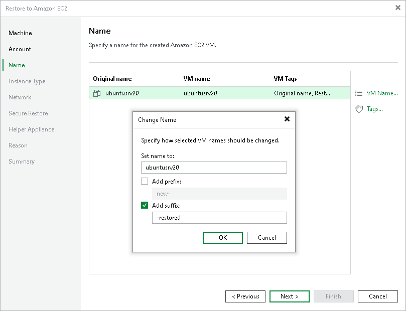

# Step 4. Specify Name and Tags

At the Name step of the wizard, you can specify names and manage AWS tags for the restored workloads. By default, Veeam Backup & Replication uses the original workload names and adds the Original name and Restore start time tags.

Specifying New Name

To define a new name for a workload that will be restored:

1. In the Machines to restore list, select a workload and click VM name.
2. In the Change Name window, enter a new name explicitly or specify a change name rule — add a prefix and suffix to the original workload name.

Managing AWS Tags

You can use AWS tags to categorize instances in Amazon EC2. A tag is a label with metadata that includes two properties: a key and a value. For more information on AWS tags, see the [AWS Documentation](https://docs.aws.amazon.com/AWSEC2/latest/WindowsGuide/Using_Tags.html).

You can modify or delete these tags, or add new ones.

|  |
| --- |
| Note |
| If you restore a workload from backups of an Amazon EC2 instance, Veeam Backup & Replication displays tags that were assigned to this instance. You can modify or delete these tags as well. |

Adding Tag

To add a new tag:

1. In the Machines to restore list, select a workload and click Tags.
2. In the Tags window, click Add.
3. In the EC2 VM Tag window, specify the Key and Value properties.

Note that you cannot add the tag with the Name key. Veeam Backup & Replication uses the Name tag to set the name for the restored EC2 instance in Amazon EC2.

Modifying Tag

To modify a tag:

1. In the Machines to restore list, select a workload and click Tags.
2. In the Tags window, select the necessary tag and click Edit.
3. In the EC2 VM Tag window, edit the Key or Value properties.

Deleting Tag

To delete a tag:

1. In the Machines to restore list, select a workload and click Tags.
2. In the Tags window, select the necessary tag and click Remove.

