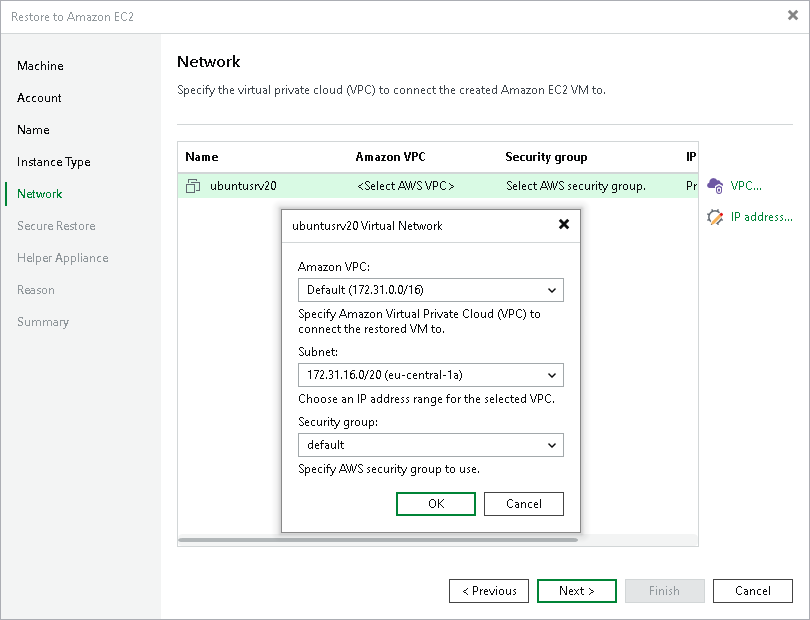
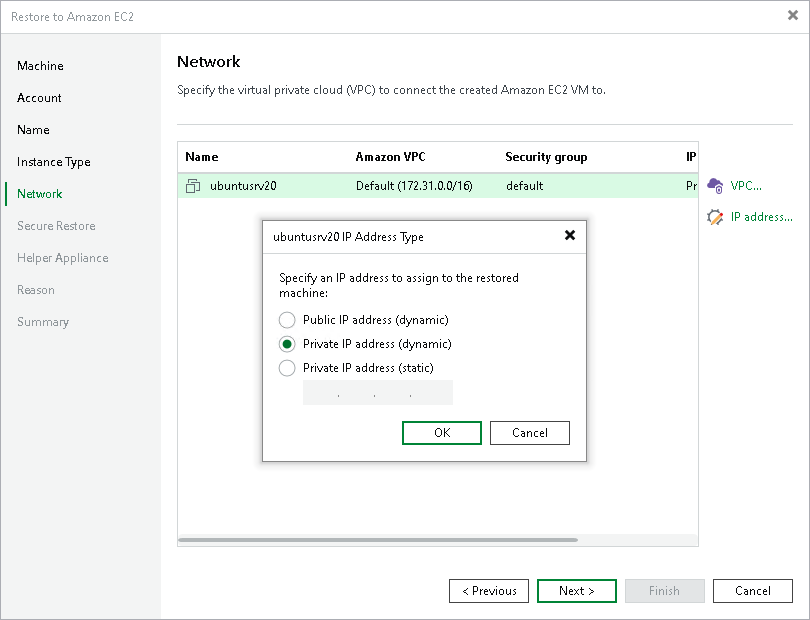

# Step 6. Configure Network Settings

In this article

At the Network step of the wizard, you can select to which Amazon Virtual Private Cloud (Amazon VPC) the restored workload must be connected. You can also specify a subnet, and a security group — a virtual firewall for the restored EC2 instance. For more information on Amazon VPC, see the [AWS Documentation](https://docs.aws.amazon.com/vpc/latest/userguide/what-is-amazon-vpc.html).

Configuring Amazon VPC

To configure Amazon VPC for the restored workload, do the following:

1. From the list, select a workload for which you want to configure the network and click VPC.
2. From the Amazon VPC list, select the Amazon VPC where the restored workload will be launched.
3. From the Subnet list, select the subnet for the restored workload.
4. From the Security group list, select a security group that will be associated with your restored workload.

Configuring IP address

To configure an IP address for the restored workload, do the following:

1. From the list, select a workload for which you want to configure the network and click IP address.
2. In the Address Type window, select which type of the IP address you want to assign: public dynamic, private dynamic or private static.

Page updated 8/22/2025

Page content applies to build 13.0.1.1071
