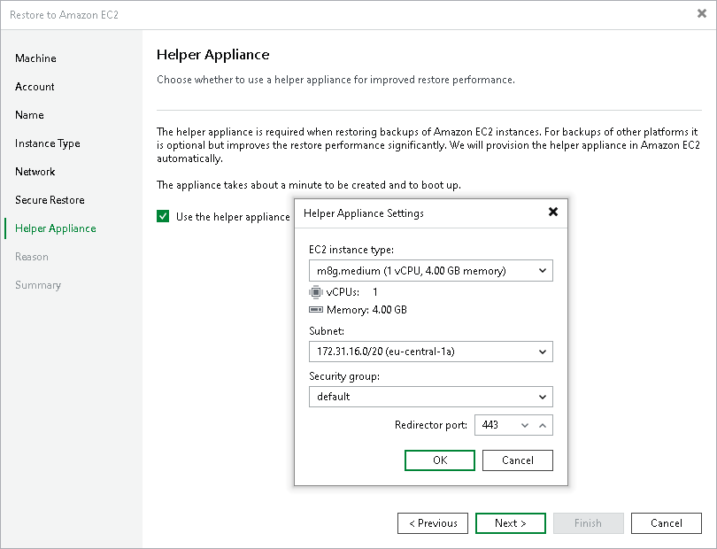

# Step 8. Configure Helper Appliance

In this article

At the Helper Appliance step of the wizard, you can specify helper appliance settings. A helper appliance is an auxiliary Linux-based instance used to upload disks of a backed-up workload to Amazon EC2. For more information on the helper appliance and requirements for it, see [Considerations and Limitations](restore_amazon_byb.md#happ).

To specify helper appliance settings, do the following:

1. Select the Use the helper appliance check box to enable the use of a helper appliance.
2. Click Customize.
3. From the EC2 instance type list, select the instance type for the helper appliance.
4. From the Subnet list, select the subnet for the helper appliance.
5. From the Security group list, select a security group that will be associated with the helper appliance.
6. In the Redirector port field, specify the port that Veeam Backup & Replication will use to route requests between the helper appliance and backup infrastructure components.

Page updated 1/7/2026

Page content applies to build 13.0.1.1071
