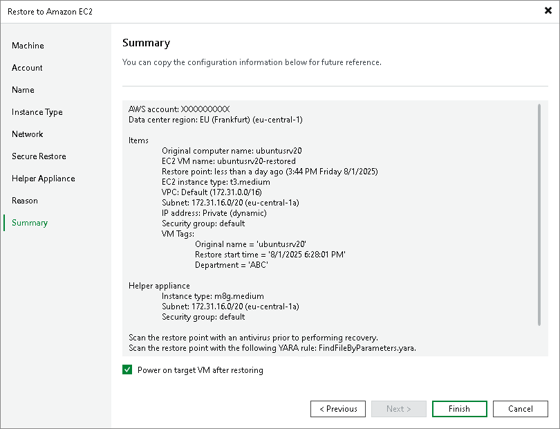

# Step 10. Verify Restore Settings

In this article

At the Summary step of the wizard, check the specified settings and click Finish. If you want to start the EC2 instance right after restore, select the Power on VM after restoring check box.

After the wizard closes, you can track the restore process in the Restore Session window. If you need to cancel the workload restore, click the Cancel restore task link.

Page updated 3/11/2025

Page content applies to build 13.0.1.1071
