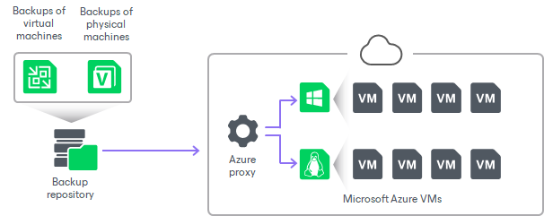

# Restore to Microsoft Azure

In this article

Veeam Backup & Replication allows you to restore different workloads (VMs, Google VM instances, physical servers and so on) from backups to Microsoft Azure.

You can use Veeam Backup & Replication to complete the following tasks:

* Restore workloads from Veeam backups to Microsoft Azure.
* Migrate workloads from the on-premises infrastructure to the cloud.
* Create a test environment in the cloud for troubleshooting, testing patches and updates and so on.

Supported Backup Types

You can restore workloads from the following types of backups:

* Backups of VMware vSphere or VMware Cloud Director virtual machines created by Veeam Backup & Replication.
* Backups of Microsoft Hyper-V virtual machines created by Veeam Backup & Replication.

* Backups of virtual and physical machines created by [Veeam Agent for Microsoft Windows or Veeam Agent for Linux](agents_introduction.md).

Backups must be created at the entire machine level or volume level.

* Backups of Amazon EC2 instances created by [Veeam Backup for AWS](https://helpcenter.veeam.com/docs/vbaws/guide/overview.html?ver=10).

* Backups of Microsoft Azure virtual machines created by [Veeam Backup for Microsoft Azure](https://helpcenter.veeam.com/docs/vbazure/guide/overview.html?ver=8.1).

* Backups of Google Compute Engine VM instances created by [Veeam Backup for Google Cloud](https://helpcenter.veeam.com/docs/vbgc/guide/welcome.html?ver=7)\*.

* Backups of Nutanix AHV VMs created by [Veeam Plug-In for Nutanix AHV](https://helpcenter.veeam.com/docs/vbahv/userguide/overview.html?ver=9).

* Backups of oVirt VMs created by [Veeam Backup for OLVM and RHV](https://helpcenter.veeam.com/docs/vbrhv/userguide/overview.html?ver=7)\*.

* Backups of Proxmox VE VMs created by [Veeam Plug-In for Proxmox VE](https://helpcenter.veeam.com/docs/vbproxmoxve/userguide/overview.html?ver=3).

* Backups of Scale Computing HyperCore VMs created by [Veeam Plug-In for Scale Computing HyperCore](https://helpcenter.veeam.com/docs/vpsch/userguide/overview.html?ver=2).

\* - Available on Microsoft Windows-based backup server.

You can restore a workload to the latest restore point or any previous restore point in the backup chain.

Veeam Backup & Replication employs the Microsoft Azure Resource Manager deployment model. Veeam Backup & Replication supports batch restore — you can launch the restore process for several VMs at a time.

VM Generation Support

Veeam Backup & Replication chooses the generation for the restored VM based on the boot loader used for the backed-up VM.

If a VM boots using the Unified Extensible Firmware Interface (UEFI) mode, Veeam Backup & Replication restores it as Generation 2. If the VM boots using the Basic Input/Output System (BIOS), Veeam Backup & Replication restores it as Generation 1. If both modes can be used, Veeam Backup & Replication restores the VM as Generation 2.

For more information about Microsoft Azure support for Generation 2 VMs, see [Microsoft Docs](https://docs.microsoft.com/en-us/azure/virtual-machines/generation-2%20).

In This Section

* [Limitations for Restore to Microsoft Azure](restore_azure_limitations.md)
* [How Restore to Microsoft Azure Works](restore_azure_hiw.md)
* [Configuring Components and Accounts for Restore](restore_azure_setup.md)
* [Restoring to Microsoft Azure](restore_azure_process.md)

Page updated 11/13/2025

Page content applies to build 13.0.1.1071
