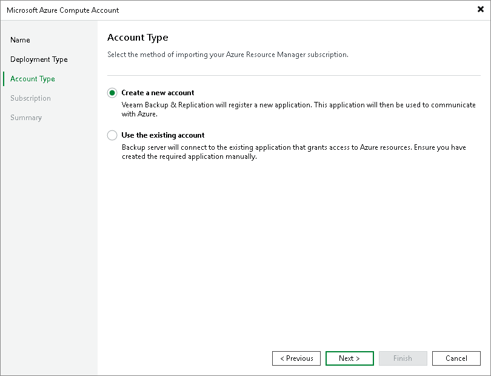

# Step 4. Select Access Type

At the Account Type step of the wizard, choose whether you want to connect to Microsoft Azure using an existing or newly created Microsoft Entra ID (formerly Azure Active Directory) application. In the latter case, Veeam Backup & Replication will create the new Microsoft Entra application automatically.

In This Section

* [Creating New Entra ID Application](restore_azure_acc_account_new.md)
* [Specifying Existing Entra ID Application](restore_azure_acc_account_existing.md)

