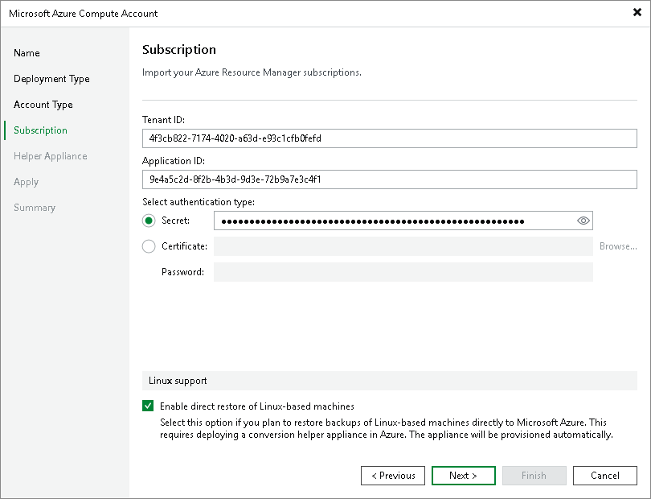

# Specifying Existing Entra ID Application

In this article

This step applies only if you have selected the Use the existing account option at the [Account Type](restore_azure_acc_account.md) step of the wizard.

Configuring Microsoft Entra Application

To use an existing Microsoft Entra ID (formerly Azure Active Directory) application:

1. In the Tenant ID specify an ID of a tenant (directory) where the Microsoft Entra application resides.
2. In the Application ID field, specify the ID of the necessary application. The Microsoft Entra application must have privileges listed in section [Permissions](required_permissions.md#azure_compute).
3. In the Select authentication type area, choose whether you want to use password-based authentication (application secret) or certificate-based authentication. Then provide the necessary information.

For more information on how to get tenant and application IDs, secret and certificate, see [Microsoft Docs](https://learn.microsoft.com/en-us/azure/active-directory/develop/howto-create-service-principal-portal#get-tenant-and-app-id-values-for-signing-in).

Enabling Direct Restore of Linux Workloads

If you plan to restore Linux-based workloads, select the Enable direct restore of Linux-based computers. When selected, this check box enables the Helper Appliance step where you will configure helper appliances. Note that the helper appliance is required if you restore Linux-based workloads that are not Azure-native.

Page updated 10/21/2024

Page content applies to build 13.0.1.1071
