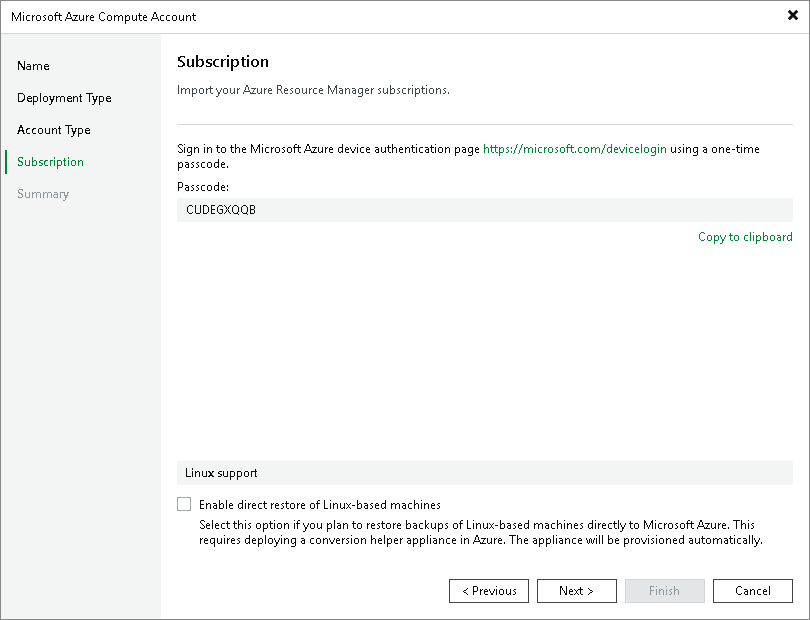

# Creating New Entra ID Application

In this article

This step applies only if you have selected the Create a new account option at the [Account Type](restore_azure_acc_account.md) step of the wizard.

Configuring Microsoft Entra Application

When you choose to create a new account, Veeam Backup & Replication registers a new Microsoft Entra ID (formerly Azure Active Directory) application in Microsoft Azure. Veeam Backup & Replication will use this application to authenticate to Azure. For more information on Microsoft Entra applications, see [Microsoft Azure Docs](https://docs.microsoft.com/en-us/azure/active-directory/active-directory-application-objects). To create the Microsoft Entra application, you must use a single-use verification code that Veeam Backup & Replication provides you.

At the Subscirption step of the wizard, do the following:

1. Click Copy to clipboard to copy the verification code.
2. Click the <https://microsoft.com/devicelogin> link.
3. On the Microsoft Azure device authentication page, do the following:

1. Paste the code that you have copied and click Next. Note that the code will expire in 15 minutes.
2. Specify a Microsoft Entra user account that will be used to create an application. Note that the user name must be specified in the [user principal name format](https://docs.microsoft.com/en-us/azure/active-directory/hybrid/plan-connect-user-signin#user-sign-in-and-user-principal-name) (username@domain). The account must have permissions described in section [Permissions](required_permissions.md#azure_compute).

Veeam Backup & Replication will retrieve information about subscriptions to which the Microsoft Entra user has access and will create Microsoft Entra application in the tenant of the account.

1. Back to the Add Azure Account wizard, check whether any errors occurred during the authentication process.

|  |
| --- |
| Note |
| Consider the following:   * If you have multiple tenants associated with the Microsoft Entra user account that you plan to use to create a new application, Veeam Backup & Replication will create the application in the home tenant of the account. As a result, the application will have access only to the subscriptions of the home tenant, as well as the Azure Compute account will. If you want to use another tenant and its subscriptions, follow the instructions in [this Veeam KB article](https://www.veeam.com/kb4108). * The created Microsoft Entra application is assigned the Contributor, Key Vault Crypto User, Storage Blob Data Contributor and Storage Queue Data Contributor role privileges for the subscriptions for which the following conditions are met: the subscriptions are linked to the home tenant of the Microsoft Entra user; the Microsoft Entra user has access to these subscriptions and can assign roles on the subscription level for the registered application.   You can limit the subscriptions to which Veeam Backup & Replication assigns the privileges as described in [this Veeam KB article](https://www.veeam.com/kb4406). For more information on roles, see [Microsoft Azure Docs](https://docs.microsoft.com/en-us/azure/active-directory/role-based-access-built-in-roles#owner). |

Enabling Direct Restore of Linux Workloads

If you plan to restore Linux-based workloads, select the Enable direct restore of Linux-based computers. When selected, this check box enables the Helper Appliance step where you will configure helper appliances. Note that the helper appliance is required if you restore Linux-based workloads that are not Azure-native.

Page updated 11/4/2025

Page content applies to build 13.0.1.1071
