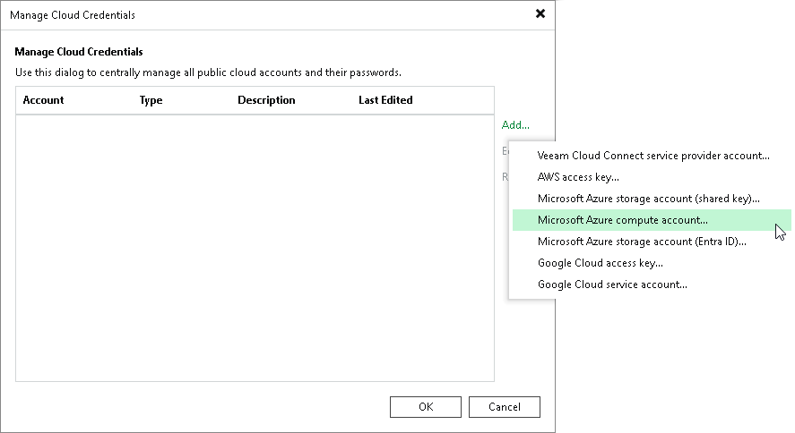

# Step 1. Launch Microsoft Azure Compute Account Wizard

In this article

To launch the Microsoft Azure Compute Account wizard, do the following:

1. In the [main menu](vbr_ui.md#main_menu), click Credentials and Passwords > Cloud Credentials.
2. In the Manage Cloud Credentials window, click Add and select Microsoft Azure compute account.

Page updated 8/28/2025

Page content applies to build 13.0.1.1071
