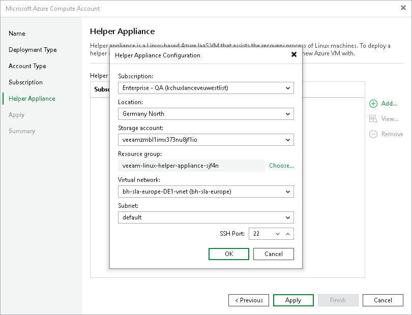

# Step 5. Configuring Helper Appliance

This step is available if you have selected Enable direct restore of Linux-based computers at the Subscription step of the wizard.

If you plan to restore Linux workloads to multiple locations, you must configure a helper appliance in each location.

To configure a helper appliance, do the following:

1. On the right of the Helper appliances list, click Add.
2. From the Subscription list, select a subscription whose resources you want to use to configure the helper appliance. The subscription list contains all subscriptions that are associated with the Azure Compute account.

To be displayed in the Subscription list, a subscription must be created in advance and associated to the Azure account as described in [Microsoft Docs](https://docs.microsoft.com/en-us/azure/active-directory/fundamentals/active-directory-how-subscriptions-associated-directory).

1. From the Location list, select a location where you want to configure the helper appliance. Make sure that you select a geographic region with which at least one storage account of the subscription is associated.
2. From the Storage account list, select a storage account whose resources you want to use to store disks of the helper appliance.

To be displayed in the Storage account drop-down list, a storage account must be created in advance as described in [Microsoft Docs](https://docs.microsoft.com/en-us/azure/storage/common/storage-account-create?tabs=azure-portal).

|  |
| --- |
| Note |
| You cannot use a storage account with the ZRS or GZRS replication option. For details, see [Microsoft Docs](https://docs.microsoft.com/en-us/azure/storage/common/storage-redundancy#zone-redundant-storage). |

1. Click Choose if you do not want Veeam Backup & Replication to create a new resource group and select the required group.

To be displayed in the Resource group drop-down list, a resource group must be created in advance as described in [Microsoft Docs](https://docs.microsoft.com/en-us/azure/azure-resource-manager/management/manage-resource-groups-portal).

1. From the Virtual network list, select a network to which the helper appliance must be connected.

To be displayed in the Virtual network drop-down list, a virtual network must be created in advance as described in [Microsoft Docs](https://docs.microsoft.com/en-us/azure/virtual-network/quick-create-portal).

1. From the Subnet list, select a subnet for the helper appliance.

To be displayed in the Subnet drop-down list, a subnet must be created in advance as described in [Microsoft Docs](https://docs.microsoft.com/en-us/azure/virtual-network/virtual-network-manage-subnet).

1. At the SSH port field, specify a port over which Veeam Backup & Replication will communicate with the helper appliance.
2. Click OK.

After you have configured all the helper appliances, click Apply and wait while Veeam Backup & Replication deploys the configured helper appliances.

