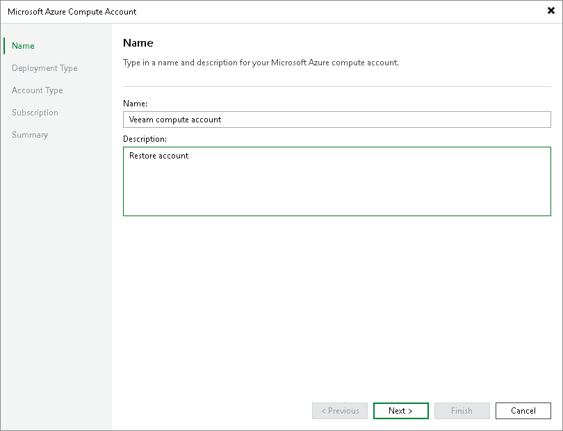

# Step 2. Specify Account Name

In this article

At the Name step of the wizard, specify a name under which this credentials record will be shown in the Cloud Credential Manager.

Page updated 1/25/2024

Page content applies to build 13.0.1.1071
