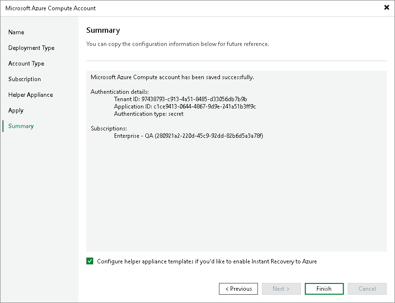

# Step 7. Finish Working with Wizard

At the Summary step of the wizard, review details of configured settings and click Finish to close the wizard.

If you plan to [recover workloads as Microsoft Azure VMs](instant_recovery_to_azure.md), select the Configure helper appliance templates. For more information, see [Helper Appliance Template](helper_appliance_template.md).

Related Topics

[Restore to Microsoft Azure](restore_azure.md)

