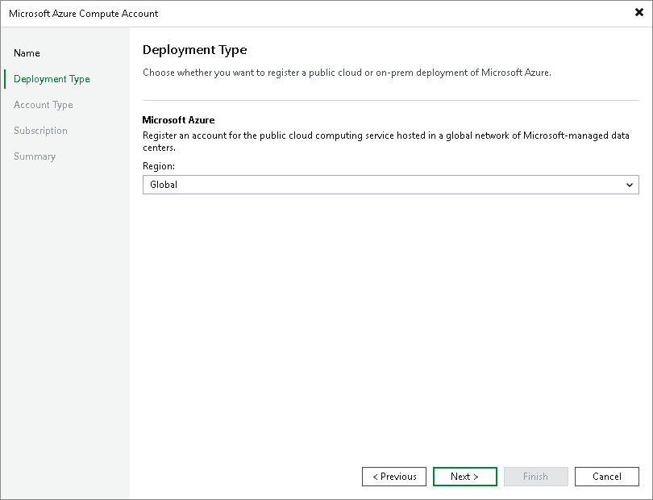

# Step 3. Select Deployment Type and Region

At the Deployment Type step of the wizard, from the Region drop-down list, select a Microsoft Azure region where your Microsoft Azure Compute account is located.

