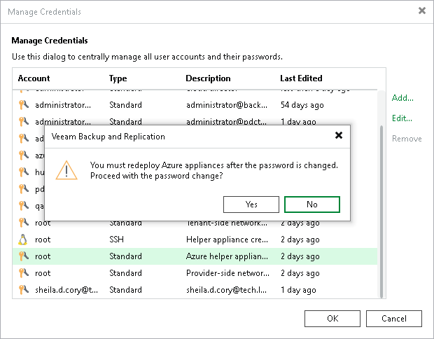

# Changing Credentials for Helper Appliances

By default, Veeam Backup & Replication uses its built-in credentials record to work with all helper appliances in Microsoft Azure and Azure Stack Hub. You can find this credential record in the credentials manger in the Veeam Backup & Replication console: the root account with "Azure helper appliance credentials" in the Description column.

For security reasons, we recommend you to change the password for this credentials record before you set up helper appliances.

|  |
| --- |
| Important |
| When you change the password in the built-in credentials record, you must re-deploy all existing helper appliances in Microsoft Azure and Azure Stack Hub. To redeploy appliances, you must [remove](restore_azure_remove_appliance.md) all configured appliances and then [configure](restore_azure_helper.md) them once again. |

To change the password in the credentials record for the helper appliances:

1. From the [main menu](vbr_ui.md), select Credentials and Passwords > Datacenter Credentials.
2. In the Manage Credentials window, click the built-in credentials record for the helper appliances.
3. Click Edit.
4. In the Password field, specify a new password.
5. Click OK to save changes.

