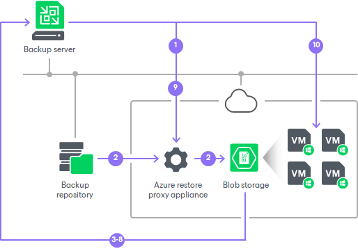
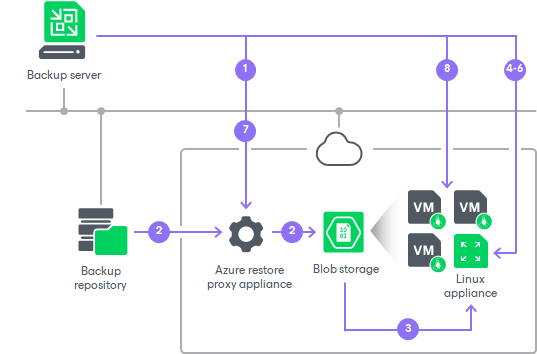

# How Restore to Microsoft Azure Works

The restore process differs for Microsoft Windows and Linux workloads.

|  |
| --- |
| Note |
| If you use Veeam Backup for Microsoft Azure and plan to restore Microsoft Azure VMs from restore points that were created using the appliance, the restore works as described in the [Performing VM Restore](https://helpcenter.veeam.com/docs/vbazure/guide/vm_restore_entire_hiw.html?ver=8.1) section in Veeam Backup for Microsoft Azure User Guide. |

Restore of Microsoft Windows Workloads

To restore a Microsoft Windows workload, Veeam Backup & Replication performs the following steps:

1. If you use an Azure restore proxy appliance (former Azure proxy) for restore, Veeam Backup & Replication powers on the Azure restore proxy appliance. For more information about the Azure restore proxy appliance, see [Managing Azure Restore Proxy Appliances](restore_azure_proxy.md).
2. Veeam Backup & Replication converts disks of a backed-up workload to the VHD format and uploads converted disks to Blob storage in Microsoft Azure.
3. Veeam Backup & Replication mounts uploaded disks to the backup server.
4. Veeam Backup & Replication enables storage controller drivers needed to boot the VM in Microsoft Azure.
5. Veeam Backup & Replication enables remote desktop connections on the restored VM.
6. Veeam Backup & Replication configures Windows Firewall rules to allow incoming remote desktop connections.
7. Veeam Backup & Replication prepares Microsoft Azure agent installation on the restored VM. Installation will start after the VM will be powered on.
8. Veeam Backup & Replication unmounts the uploaded disks from the backup server.
9. If you use an Azure restore proxy appliance for restore, Veeam Backup & Replication powers off the Azure restore proxy appliance after a timeout.
10. Veeam Backup & Replication registers a Microsoft Azure VM with the prepared workload disks. After the registration process is complete, the Microsoft Azure VM is powered on immediately. Then the Microsoft Azure agent is installed on the VM.

Restore of Linux Workloads

For restore of Linux workloads, Veeam Backup & Replication uses a helper appliance. The helper appliance is a Linux-based VM in Microsoft Azure registered by Veeam Backup & Replication. During the restore process, Veeam Backup & Replication mounts disks of a backed-up workload to the helper appliance to prepare disks for restore. For more information, see [Managing Helper Appliances](restore_azure_linux.md).

To restore a Linux workload, Veeam Backup & Replication performs the following steps:

1. If you use an Azure restore proxy appliance (former Azure proxy) for restore, Veeam Backup & Replication powers on the Azure restore proxy appliance. For more information about the Azure restore proxy appliance, see [Managing Azure Restore Proxy Appliances](restore_azure_proxy.md).
2. Veeam Backup & Replication converts disks of a backed-up workload to the VHD format and uploads converted disks to Blob storage in Microsoft Azure.
3. Veeam Backup & Replication mounts uploaded disks to the helper appliance that resides in the location to which you restore the Linux workload.
4. Veeam Backup & Replication starts the helper appliance with mounted disks.
5. Veeam Backup & Replication makes configuration changes needed for the VM to boot in Microsoft Azure.
6. Veeam Backup & Replication unmounts prepared disks from the helper appliance and powers off the helper appliance.
7. If you use an Azure restore proxy appliance for restore, Veeam Backup & Replication powers off the Azure restore proxy appliance after a timeout.
8. Veeam Backup & Replication registers a Microsoft Azure VM with the prepared workload disks. After the registration process is complete, the VM is powered on immediately.

