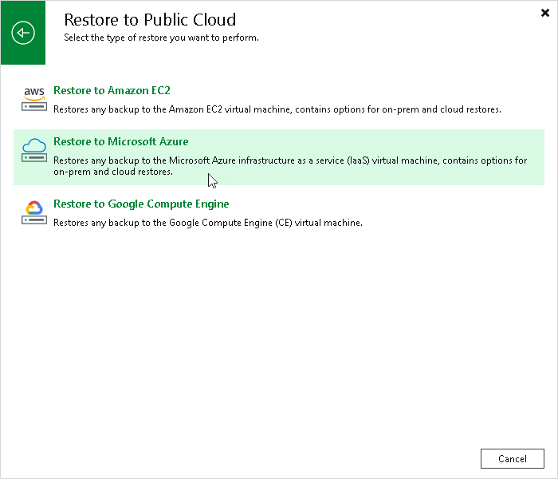

# Step 1. Launch Restore to Azure Wizard

In this article

To launch the Restore to Azure wizard, do one of the following:

* On the Home tab, click Restore and select the type of backups from which you want to restore:

+ VMware vSphere
+ VMware Cloud Director
+ Microsoft Hyper-V
+ Agent
+ AWS
+ GCE backup
+ Nutanix backup
+ oVirt KVM
+ Proxmox VE
+ Scale Computing HyperCore

In the displayed window, click Entire machine restore > Restore to public cloud > Restore to Microsoft Azure.

* Open the Home view. In the inventory pane, click Backups. In the working area, expand the necessary backup, select workloads that you want to restore and click Entire VM > Microsoft Azure on the ribbon. Alternatively, you can right-click one of the workloads that you want to restore and select Restore entire VM > Microsoft Azure.

Page updated 10/28/2025

Page content applies to build 13.0.1.1071
