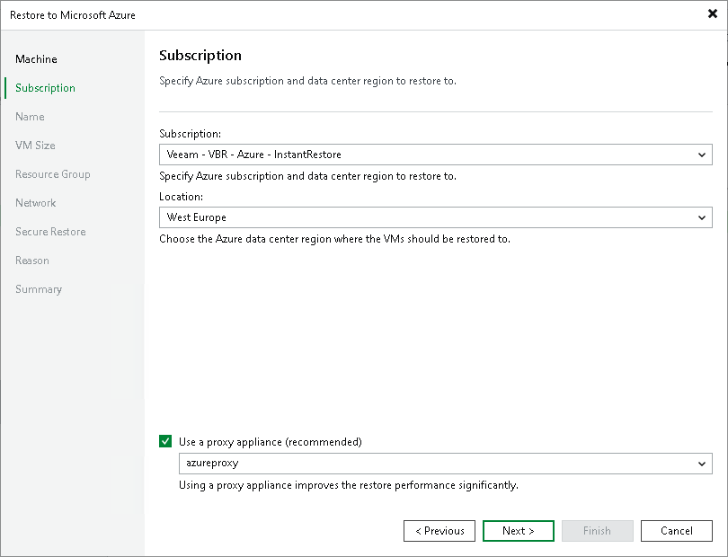

# Step 3. Select Subscription and Location

At the Subscription step of the wizard, select a subscription, location for the restored workloads and define how workload data must be transported to Microsoft Azure or Azure Stack Hub:

1. From the Subscription list, select a subscription whose resources you want to use. The subscription list contains all subscriptions associated with the Azure compute or Azure Stack Hub Compute accounts that you have added to Veeam Backup & Replication.
2. From the Locations list, select a geographic region to which you want to place the restored workloads. Make sure that you select a geographic region with which at least one storage account of the subscriptions is associated.
3. If you are restoring the workloads to a distant location and want to speed up the restore process, select the Use a proxy appliance check box. From the drop-down list, select an Azure restore proxy appliance.

It is recommended that you configure the Azure restore proxy appliance in the same location to which you plan to restore the workload. For more information, see [Managing Azure Restore Proxy Appliances](restore_azure_proxy.md).

|  |
| --- |
| Important |
| [For restore of Linux workloads] You must have a preconfigured helper appliance in the location to which you restore Linux workloads. If the appliance is not configured, Veeam Backup & Replication will display the Microsoft Azure Compute Account wizard so that you can configure the appliance in the selected location. |

