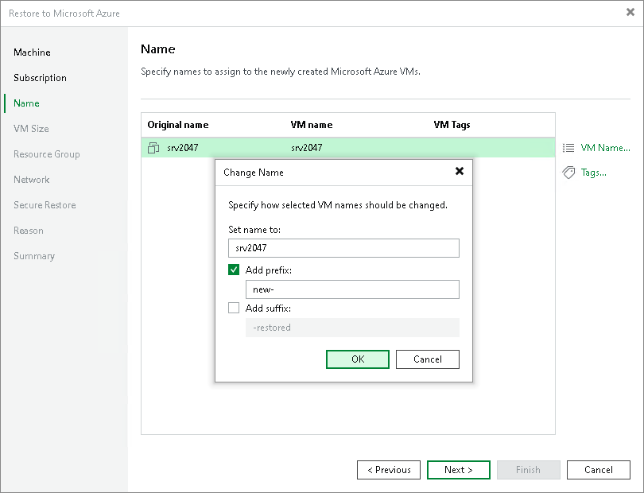
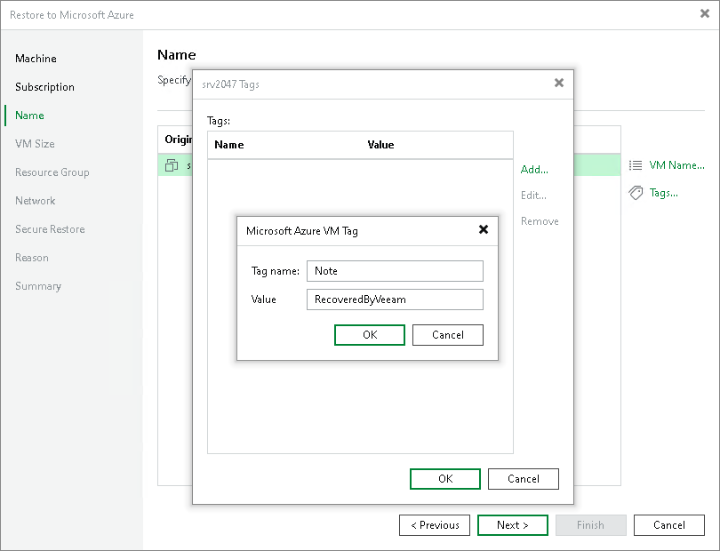

# Step 4. Specify Names and Tags

At the Name step of the wizard, you can specify new names for the restored workloads and assign tags to them. By default, Veeam Backup & Replication restores workloads with their original names.

Specifying New Names

To define a new name for a workload:

1. In the list, select a workload and click Name.
2. In the Change Name window, enter a new name explicitly or specify a change name rule — add a prefix and suffix to the original workload name.

Adding Tags

To add a tag for the recovered workloads:

1. In the list, select a workload and click Tags.
2. In the Tags window, click Add.
3. In the Microsoft Azure VM Tag window, specify the tag name and its value.

