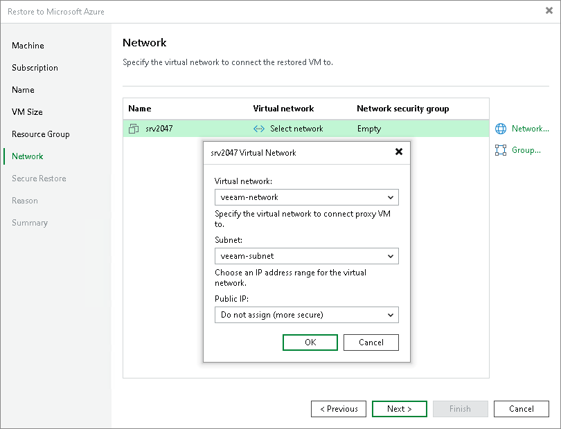

# Step 7. Configure Network Settings

In this article

At the Network step of the wizard, select to which networks and subnets the restored workloads will be connected. By default, Veeam Backup & Replication creates a new security group for the restored workloads. The default security group rules are listed in [Default Security Group Rules](#rules).

Configuring Network

To define network settings for a workload, do the following:

1. In the Virtual network list, select a workload and click Network.
2. From the Virtual network drop-down list, select a network to which the workload must be connected.
3. From the Subnet drop-down list, select a subnet for the workload.
4. In the Public IP field, specify whether to assign a public IP to the workload. You have two options:

* Assign (restored VM will be accessible from the Internet). The public IP will be assigned to the restored workload. For security reasons, make sure traffic filtration rules are properly configured in the security group.
* Do not assign (more secure). The public IP will not be assigned. You can assign a public IP later in the settings of the restored workload.

|  |
| --- |
| Note |
| Veeam Backup & Replication can connect a workload only to one virtual network. If necessary, you can manually configure additional network connections in Microsoft Azure after the workload is restored. |

Configuring Security Group

To change a security group to which a workload will be restored:

1. From the Virtual network list, select a workload and click Group.
2. Select the network security group from the Network security group list.

If you leave the Empty value, Veeam Backup & Replication will create a new network security group. The rules for this group are described in [Default Security Group Rules](#rules).

Default Security Group Rules

When you leave the Empty value while configuring the security group, Veeam Backup & Replication creates a security group with the following rules.

| Priority | Name | Port | Protocol | Source | Destination | Action |
| --- | --- | --- | --- | --- | --- | --- |
| Inbound security rules | | | | | | |
| 300 | SSH  Note: This rule applies if you restore Linux VMs. | 22 | TCP | Any | Any | Allow |
| 300 | RemoteDesktop  Note: This rule applies if you restore Microsoft Windows VMs. | 3389 | TCP | Any | Any | Allow |
| 65000 | AllowVnetInBound | Any | Any | VirtualNetwork | VirtualNetwork | Allow |
| 65001 | AllowAzureLoadBalancerInBound | Any | Any | AzureLoadBalancer | Any | Allow |
| 65500 | DenyAllInBound | Any | Any | Any | Any | Deny |
| Outbound security rules | | | | | | |
| 65000 | AllowVnetOutBound | Any | Any | VirtualNetwork | VirtualNetwork | Allow |
| 65001 | AllowInternetOutBound | Any | Any | Any | Internet | Allow |
| 65500 | DenyAllOutBound | Any | Any | Any | Any | Deny |

Page updated 7/3/2025

Page content applies to build 13.0.1.1071
