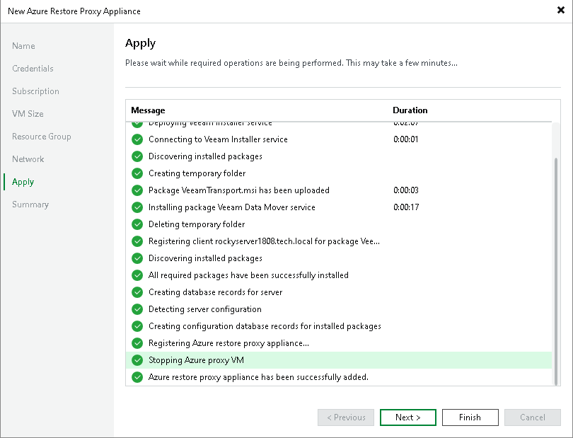

# Step 8. Start Deployment

In this article

At the Apply step of the wizard, Veeam Backup & Replication deploys the Azure restore proxy appliance with the specified settings. You can view the deployment progress in the real-time mode. When the configuration process is over, click Next. At the Summary step of the wizard, click Finish to close the wizard.

|  |
| --- |
| Tip |
| The Azure restore proxy appliance deployment may take several minutes. You can close the New Azure Restore Proxy Appliance wizard and continue working with Veeam Backup & Replication while the helper appliance is being deployed. To view the deployment progress, open the History view, in the inventory pane select System, and double-click the task of the helper appliance deployment in the working area. |

Page updated 3/11/2025

Page content applies to build 13.0.1.1071
