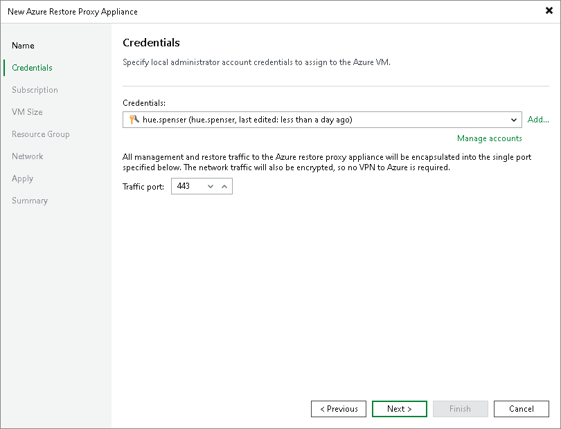

# Step 3. Specify Credentials and Transport Port

In this article

At the Credentials step of the wizard, specify credentials of the local administrator account on the Azure restore proxy appliance and define the transport port:

1. From the Credentials list, select credentials of a user that will be assigned the Local Administrator permissions on the Azure restore proxy appliance.

If you have not set up credentials beforehand, click the Manage accounts link or click Add on the right to add the credentials. For more information, see [Credentials Manager](credentials_manager.md).

|  |
| --- |
| Important |
| Consider the following:   * You cannot use reserved names such as 'administrator', 'admin', 'user', 'abc@123', 'P@$$w0rd' and so on as a user name and password of the local administrator account. * You must specify the user name without a domain or Microsoft Azure machine name. * The password must be at least 8 characters long, and must contain at least 1 uppercase character, 1 lowercase character, 1 numeric character and 1 special character. |

1. In the Traffic port field, specify a port over which Veeam Backup & Replication will control components installed on the Azure restore proxy appliance and transport workload disks data to Blob storage. The port must be accessible from the backup server and backup repository that stores backups.

Page updated 3/11/2025

Page content applies to build 13.0.1.1071
