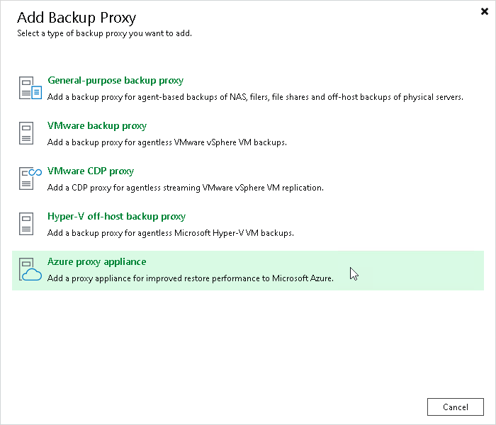

# Step 1. Launch New Azure Restore Proxy Appliance Wizard

To launch the New Azure Restore Proxy Appliance wizard, do one of the following:

1. Open the Backup Infrastructure view.
2. In the inventory pane, right-click the Backup Proxies node and select Add Proxy. Alternatively, you can click Add Proxy on the ribbon.
3. In the Add Backup Proxy window, select Azure proxy appliance.

