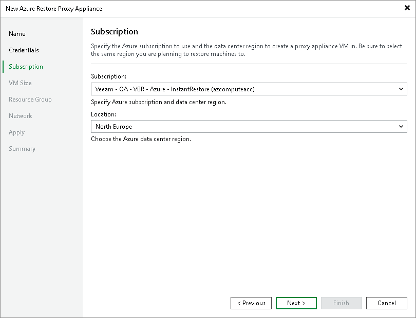

# Step 4. Select Subscription and Location

At the Subscription step of the wizard, select a subscription and location for the Azure restore proxy appliance:

1. From the Subscription list, select a subscription whose resources you want to use to deploy the Azure restore proxy appliance. The subscription list contains all subscriptions associated with Azure or Azure Stack Hub Compute accounts that you added to Veeam Backup & Replication.
2. From the Locations list, select a geographic region to which you want to place the Azure restore proxy appliance. Make sure that you select a geographic region with which at least one storage account of the subscription is associated.

