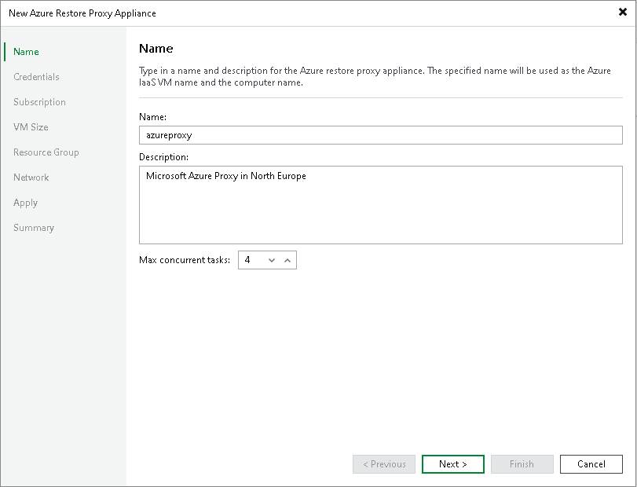

# Step 2. Specify Azure Restore Proxy Appliance Name

In this article

At the Name step of the wizard, specify a name and description for the Azure restore proxy appliance:

1. In the Name field, specify a name for the Azure restore proxy appliance. The name must meet the following requirements:

* The name must not be longer than 15 characters.
* The name must contain only alphanumeric characters and hyphens.
* The name must start with a letter and end with a letter or number.
* The name must not contain only numeric characters.
* The name must not contain special characters: `!@#$%^&\*()+=\_[]{}\;:.'",<>/?.

1. In the Description field, provide a description for the Azure restore proxy appliance.
2. At the Max concurrent tasks field, specify the number of tasks that the Azure restore proxy appliance must handle in parallel. If the Max concurrent tasks value is exceeded, the Azure restore proxy appliance will not start a new task until one of current tasks finishes.

Veeam Backup & Replication creates one task per one workload disk. By default, Azure restore proxy appliance handles 4 concurrent tasks.

Page updated 8/21/2025

Page content applies to build 13.0.1.1071
