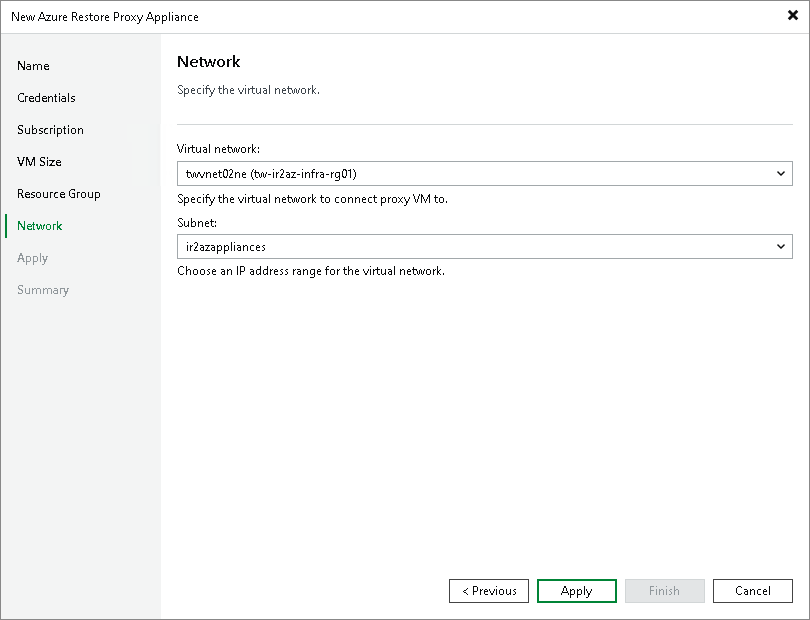

# Step 7. Select Virtual Network

In this article

At the Network step of the wizard, you select to which network and subnet the Azure restore proxy appliance will be connected.

|  |
| --- |
| Important |
| If you want to restore from backups in an on-premises object storage repository, the selected virtual network must have access to the source object storage repository. To provide access to object storage repositories, you can use VPN or Azure ExpressRoute. For more information, see [this Veeam KB article](https://www.veeam.com/kb4014). |

Page updated 3/11/2025

Page content applies to build 13.0.1.1071
