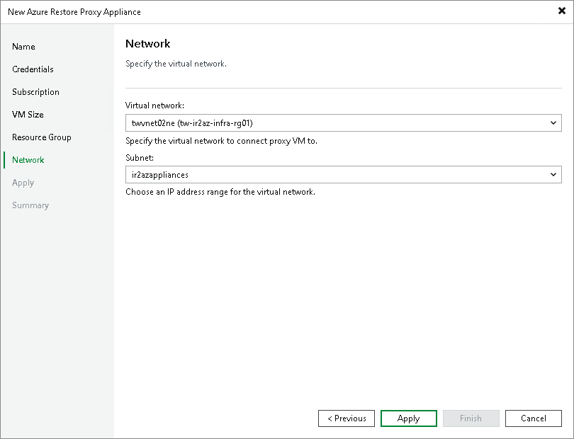

# Step 7. Select Virtual Network

At the Network step of the wizard, you select to which network, subnet and security group the Azure restore proxy appliance will be connected:

1. From the Virtual network drop-down list, select a network to which the Azure restore proxy appliance must be connected.
2. From the Subnet drop-down list, select a subnet.
3. From the Network security group drop-down list, how Veeam Backup & Replication assigns a network security group:

1. Create new. Veeam Backup & Replication creates a new network security group. The rules for this group are described in [Default Security Group Rules](restore_azure_proxy_network.md#rules).
2. Do not assign (use subnet settings). Veeam Backup & Replication uses the network security group already associated with the target subnet.
3. <existing group list>. Veeam Backup & Replication assigns the selected network security group.

|  |
| --- |
| Important |
| If you want to restore from backups in an on-premises object storage repository, the selected virtual network must have access to the source object storage repository. To provide access to object storage repositories, you can use VPN or Azure ExpressRoute. For more information, see [this Veeam KB article](https://www.veeam.com/kb4014). |

Default Security Group Rules

When you select the Create new option while configuring the security group, Veeam Backup & Replication creates a security group with the following rules.

Default Security Group Rules

| Priority | Name | Port | Protocol | Source | Destination | Action |
| Inbound security rules | | | | | | |
| 300 | SSH  Note: This rule applies if you recover Linux VMs. | 22 | TCP | Any | Any | Allow |
| 300 | RemoteDesktop  Note: This rule applies if you recover Microsoft Windows VMs. | 3389 | TCP | Any | Any | Allow |
| 65000 | AllowVnetInBound | Any | Any | VirtualNetwork | VirtualNetwork | Allow |
| 65001 | AllowAzureLoadBalancerInBound | Any | Any | AzureLoadBalancer | Any | Allow |
| 65500 | DenyAllInBound | Any | Any | Any | Any | Deny |
| Outbound security rules | | | | | | |
| 65000 | AllowVnetOutBound | Any | Any | VirtualNetwork | VirtualNetwork | Allow |
| 65001 | AllowInternetOutBound | Any | Any | Any | Internet | Allow |
| 65500 | DenyAllOutBound | Any | Any | Any | Any | Deny |

Page updated 2026-06-22

