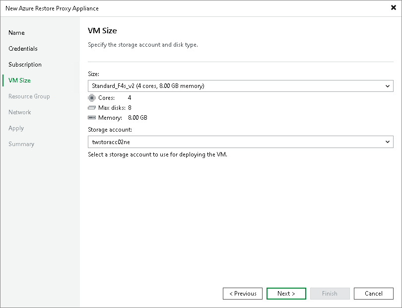

# Step 5. Select VM Size

In this article

At the VM size step of the wizard, you can select the size for the Azure restore proxy appliance VM and specify which storage account you want to use to deploy the Azure restore proxy appliance VM:

1. From the Size list, select the size for the Azure restore proxy appliance.

The default size is Standard\_F4s\_v2. If Standard\_F4s\_v2 is not available, we recommend that you select a similar compute optimized VM size of the previous generation — F-series. For example, Standard\_F4, Standard\_F4s. These sizes are sufficient to transport VM disks data to Blob storage. If necessary, you can select a greater size for the Azure restore proxy appliance.

|  |
| --- |
| Note |
| Azure restore proxy appliance VMs created in Veeam Backup & Replication version prior 10a have smaller sizes — Basic\_A2. We recommend you to change sizes of such proxies to the sizes listed in this point. This will enhance the performance of restore to Azure.  You can change VM sizes in [Microsoft Azure Portal](https://azure.microsoft.com/en-us/features/azure-portal/) or deploy new proxies with the required sizes in the Veeam Backup & Replication. |

1. From the Storage account list, select a storage account where Veeam Backup & Replication will store components required for Azure restore proxy appliance deployment. After restore, the components will be removed from the storage account.

[For Azure Stack Hub] Veeam Backup & Replication will store disks of the Azure restore proxy appliance in the selected storage account. The storage account must be compatible with the VM size you select.

The list of storage accounts will contain only general purpose storage accounts. Blob storage accounts will not be displayed in the list of subscriptions. For more information about account types, see [Microsoft Docs](https://learn.microsoft.com/en-us/azure/storage/common/storage-account-create?tabs=azure-portal).

|  |
| --- |
| Note |
| You cannot use a storage account with the ZRS or GZRS replication option for the Azure restore proxy appliance. For details, see [Microsoft Docs](https://docs.microsoft.com/en-us/azure/storage/common/storage-redundancy#zone-redundant-storage). |

|  |
| --- |
| Tip |
| Microsoft Azure subscriptions have default limits on the number of CPU cores. Make sure that the VM size you select does not exceed limits of the subscription. |

Page updated 3/11/2025

Page content applies to build 13.0.1.1071
