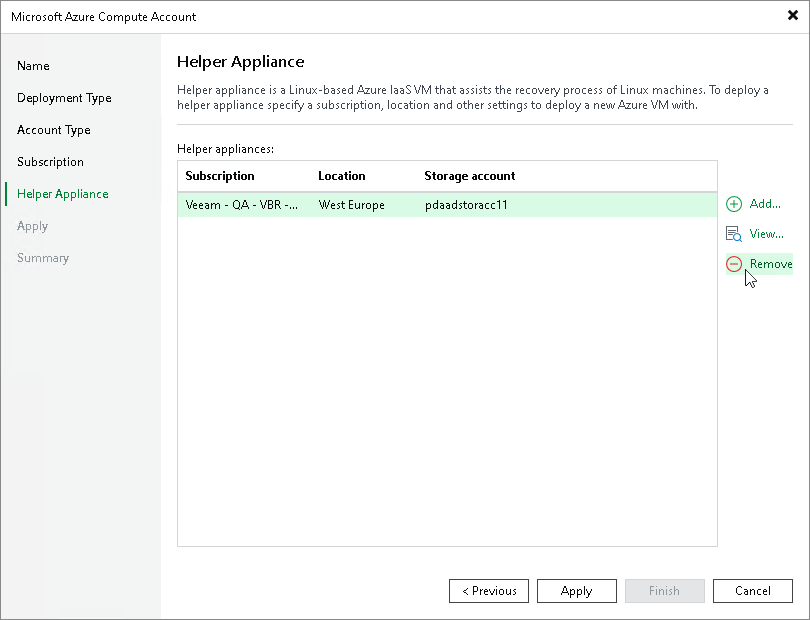

# Removing Helper Appliances

In this article

If you no longer need to restore Linux workloads to Azure or Azure Stack Hub, you can remove helper appliances:

1. From the main menu, select Credentials & Passwords > Cloud Credentials.
2. In the accounts list, select the Azure account and click Edit.
3. Pass to the Helper Appliance step of the Microsoft Azure Compute Account wizard.
4. In the Helper appliances list, select the helper appliance and click Remove.

|  |
| --- |
| Important |
| Do not clear the Enable restore of Linux-based computers check box at the Subscription step of the wizard before removing helper appliances. If you clear the check box, the Microsoft Azure Compute Account wizard will not display the Helper Appliance step. Helper appliances themselves will remain in Microsoft Azure. Clear the Enable restore of Linux-based computers check box only after you remove the helper appliances.  You can remove all helper appliances using the [Deploy-VBRAzureLinuxRestoreAppliance](https://helpcenter.veeam.com/docs/vbr/powershell/deploy-vbrazurelinuxrestoreappliance.html?ver=13) PowerShell cmdlet. |

Page updated 4/17/2025

Page content applies to build 13.0.1.1071
