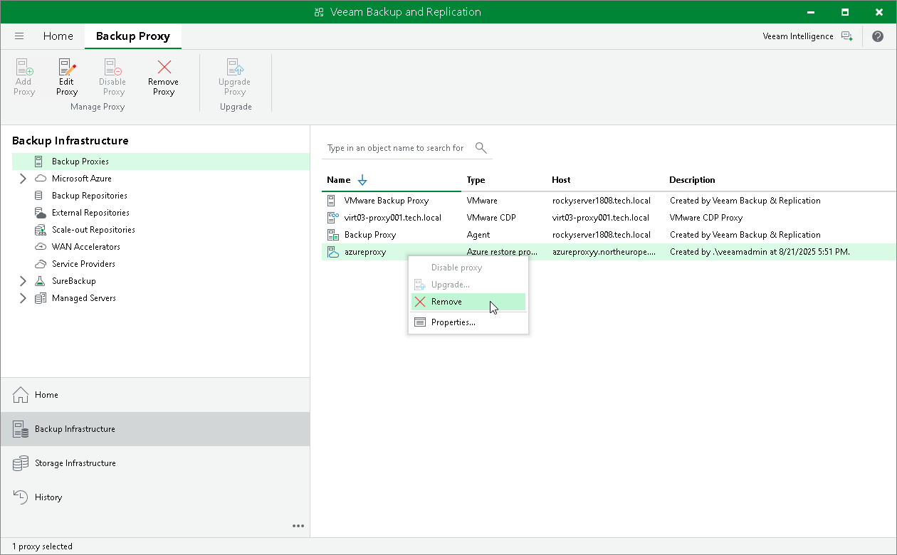

# Removing Azure Restore Proxy Appliances

In this article

Veeam Backup & Replication does not provide a possibility to edit settings of deployed Azure restore proxy appliances. If you want to change Azure restore proxy appliance configuration, remove the Azure restore proxy appliance and create a new Azure restore proxy appliance.

To remove an Azure restore proxy appliance, do the following:

1. Open the Backup Infrastructure view.
2. In the inventory pane, select Backup Proxies.
3. In the working area, right-click the Azure restore proxy appliance and select Remove.

|  |
| --- |
| Important |
| If you want to remove an Azure or an Azure Stack Hub Compute account from Veeam Backup & Replication, you must remove all Azure restore proxy appliances first. |

Page updated 8/21/2025

Page content applies to build 13.0.1.1071
