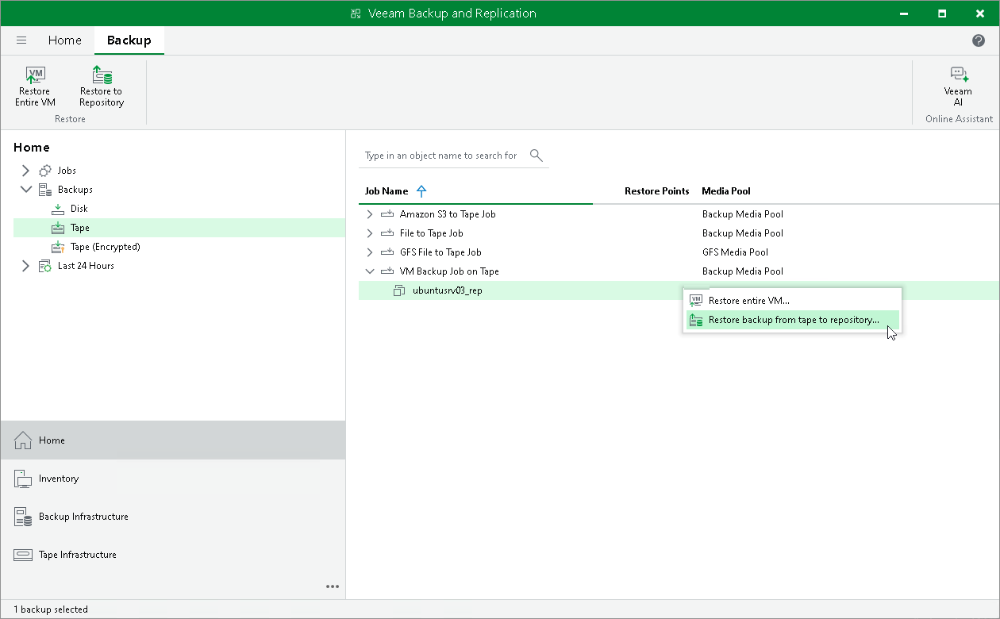

# Step 1. Launch Restore Backup from Tape to Repository Wizard

To run the Restore Backup from Tape to Repository wizard, on the Home tab, click Restore and choose Tape > Restore Backups.

Alternatively, you can:

* Open the Home view, expand the Backups > Tape node. Select the necessary machines in backup and click Restore to Repository on the ribbon.
* Open the Home view, expand the Backups > Tape node. Right-click the necessary machines in backup and choose Restore backup from tape to repository.

