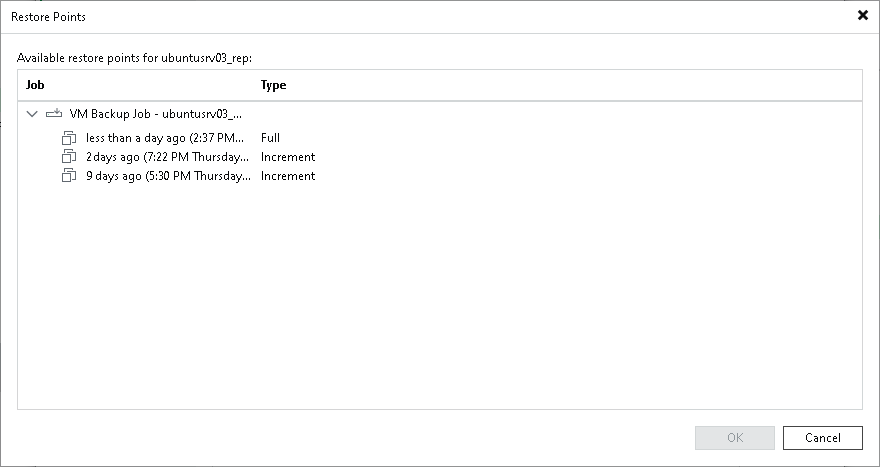

# Step 3. Select Restore Point

By default, Veeam Backup & Replication will restore backup with the latest state of the archived machine. However, if you want to restore a backup for the machine to an earlier state, select a machine in the list and click Point on the right. In the Restore Points window, select a restore point that should be used to restore the backup.

|  |
| --- |
| Note |
| If you choose a full backup point in the list, Veeam Backup & Replication will restore only this full backup. If you choose an increment, Veeam Backup & Replication will restore a chain consisting of a full backup and forward increments, necessary to restore machines to the required point-in-time. |

If you have chosen to restore multiple machines, you can select a different restore point for every machine specifically.

